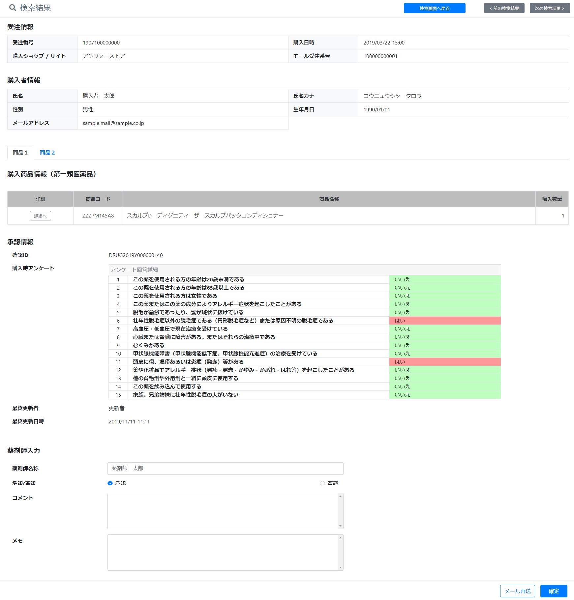

# 詳細
||  
|:-:|

## Action

| Action No. | Action名 | 概要 | 画面 | 遷移先 | 中継API | 
| --- | --- | --- | --- | --- | --- |
| A | カート作成 | カート作成 | 1 | own | order.Cart/post_carts |

## 中継API
### A: 検索

| API名 | リンク |
| --- | --- |
| 注文データ取得API | [order.Cart/post_carts](http://3.114.104.100/#/order.Cart/post_carts) |

#### Request

| 物理名 | 型（桁） | 論理名(David) | 論理名（Prismatix） |
| --- | --- | --- | --- |
| * | * | * | * |

#### Response

| 物理名 | 型（桁） | 論理名(David) | 論理名（Prismatix） |
| --- | --- | --- | --- |
| * | * | * | * |