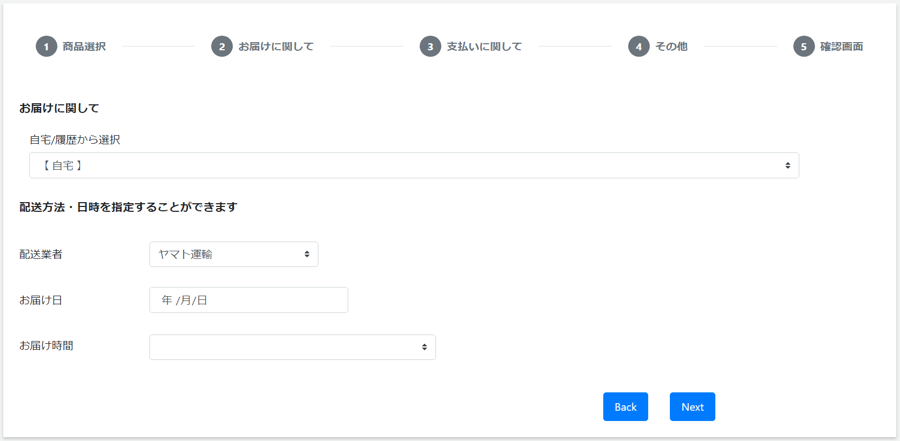

# 購入: Step2 配送
||  
|:-:|

## Action

| Action No. | Action名 | 概要 | 画面 | 遷移先 | 中継API | 
| --- | --- | --- | --- | --- | --- |
| A | | | 1 | own | |

## 中継API
### A: ***

| API名 | リンク |
| --- | --- |
| | |

#### Request

| 物理名 | 型（桁） | 論理名(David) | 論理名（Prismatix） |
| --- | --- | --- | --- |
| | | | |

#### Response

| 物理名 | 型（桁） | 論理名(David) | 論理名（Prismatix） |
| --- | --- | --- | --- |
| | | | |