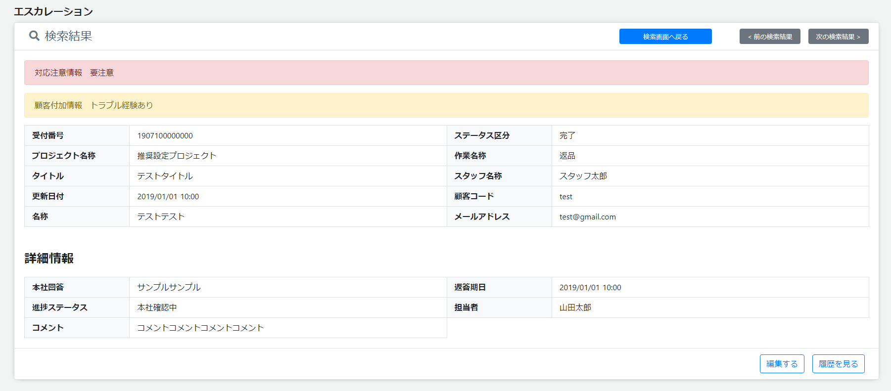
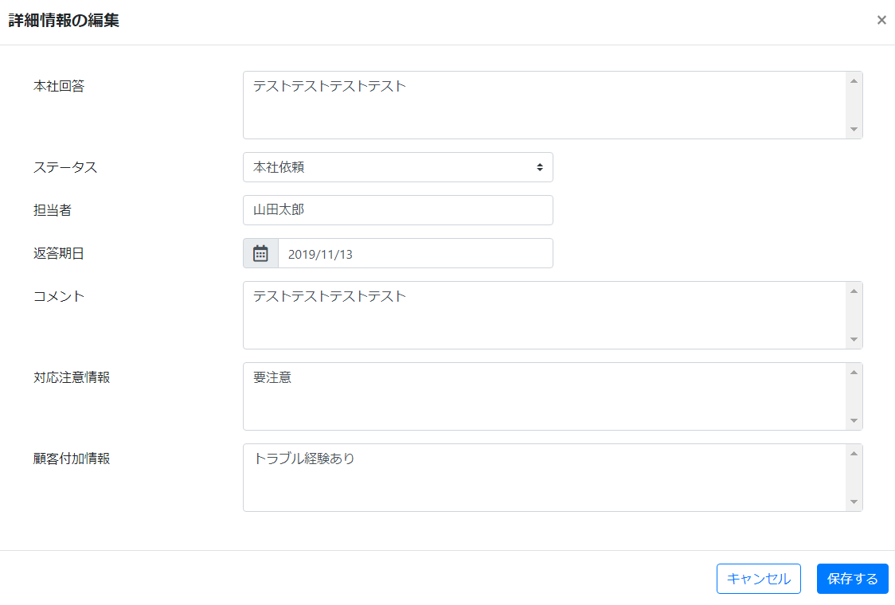
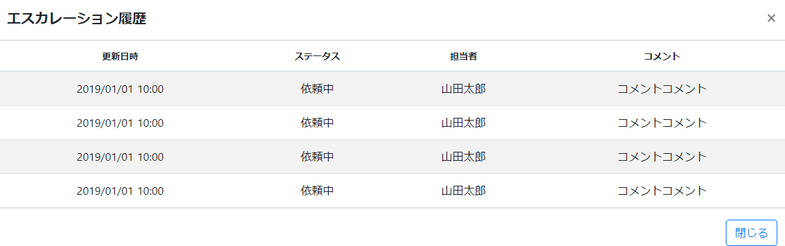

# 詳細
||
|:-:|

||
|:-:|

||
|:-:|

## Action

| Action No. | Action名 | 概要 | 画面 | 遷移先 | 中継API | 
| --- | --- | --- | --- | --- | --- |
| A | エスカレーション取得 | エスカレーションを取得する | 1 | own | [contact.Escalation/escalationsEscalation_codeGET](http://3.114.104.100/#/contact.Escalation/escalationsEscalation_codeGET) |
| B | 詳細情報更新 | エスカレーションの詳細情報を更新する | 1 | own | [contact.Escalation/escalationsEscalation_codePOST](http://3.114.104.100/#/contact.Escalation/escalationsEscalation_codePOST) |
| C | 履歴取得 | エスカレーションの履歴情報取得する | 1 | own |  |

## 中継API
### A: エスカレーション取得

| API名 | リンク |
| --- | --- |
| エスカレーション取得API | [contact.Escalation/escalationsEscalation_codeGET](http://3.114.104.100/#/contact.Escalation/escalationsEscalation_codeGET) |

#### Request

| 必須 | 物理名 | 型（桁） | 論理名(David) | 論理名（Prismatix） |
| --- | --- | --- | --- | --- |
| 〇 | escalation_code(Excelなし) |  |  |  |

#### Response

| 必須 | 物理名 | 型（桁） | 論理名(David) | 論理名（Prismatix） |
| --- | --- | --- | --- | --- |
| 〇 | contact_code(Excelなし) |  |  |  |
| 〇 | contents(Excelなし) |  |  |  |
| 〇 | title(Excelなし) |  |  |  |
| 〇 | contact_staff_name(Excelなし) |  |  |  |
| 〇 | status(Excelなし) |  |  |  |
| 〇 | escalation_staff(Excelなし) |  |  |  |
| 〇 | comment(Excelなし) |  |  |  |
| 〇 | tasks(Excelなし) |  |  |  |
| 〇 | return_category(Excelなし) |  |  |  |
| 〇 | emergency_flg(Excelなし) |  |  |  |

### B: 詳細情報更新

| API名 | リンク |
| --- | --- |
| 詳細情報更新API | [contact.Escalation/escalationsEscalation_codePOST](http://3.114.104.100/#/contact.Escalation/escalationsEscalation_codePOST) |

#### Request

| 必須 | 物理名 | 型（桁） | 論理名(David) | 論理名（Prismatix） |
| --- | --- | --- | --- | --- |
| 〇 | escalation_code(Excelなし) |  |  |  |
|  | contact_code(Excelなし) |  |  |  |
|  | status(Excelなし) |  |  |  |
|  | escalation_staff(Excelなし) |  |  |  |
|  | comment(Excelなし) |  |  |  |

#### Response

| 必須 | 物理名 | 型（桁） | 論理名(David) | 論理名（Prismatix） |
| --- | --- | --- | --- | --- |
| 〇 | (status_code) |  |  |  |

### C: 履歴取得

| API名 | リンク |
| --- | --- |
| 履歴取得API |  |

#### Request

| 必須 | 物理名 | 型（桁） | 論理名(David) | 論理名（Prismatix） |
| --- | --- | --- | --- | --- |
|  |  |  |  |  |

#### Response

| 必須 | 物理名 | 型（桁） | 論理名(David) | 論理名（Prismatix） |
| --- | --- | --- | --- | --- |
|  |  |  |  |  |

## 確認事項
* A: エスカレーション取得の Responses にステータス区分がない
* A: エスカレーション取得の Responses にプロジェクト名称がない
* A: エスカレーション取得の Responses にメールアドレスがない
* A: エスカレーション取得の Responses に本社回答がない
* A: エスカレーション取得の Responses に返答期日がない
* A: エスカレーション取得の Responses に対応注意情報がない
* A: エスカレーション取得の Responses に顧客付加情報がない
* B: 詳細情報更新の Request に本社回答がない
* B: 詳細情報更新の Request に返答期日がない
* B: 詳細情報更新の Request に対応注意情報がない
* B: 詳細情報更新の Request に顧客付加情報がない
* エスカレーション履歴を取得するのはどのAPI？