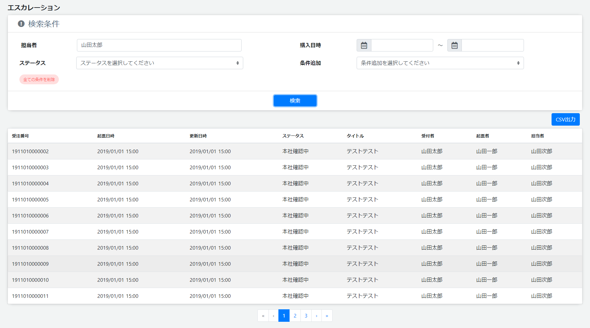

# 検索
||
|:-:|

## Action

| Action No. | Action名 | 概要 | 画面 | 遷移先 | 中継API | 
| --- | --- | --- | --- | --- | --- |
| A | エスカレーション検索 | エスカレーションの検索をする | 1 | own | order.Cart/post_carts |
| B | 詳細画面へ遷移 | エスカレーションを特定し詳細画面へ遷移する | 2 | エスカレーション詳細 | [] |

## 中継API
### A: エスカレーション検索

| API名 | リンク |
| --- | --- |
| エスカレーション検索API | [contact.Escalation/escalations_searchPOST](http://3.114.104.100/#/contact.Escalation/escalations_searchPOST) |

#### Request

| 必須 | 物理名 | 型（桁） | 論理名(David) | 論理名（Prismatix） |
| --- | --- | --- | --- | --- |
|  | source_includes(Excelなし) |  |  |  |
|  | query(Excelなし) |  |  |  |
|  | query_fields(Excelなし) |  |  |  |

#### Response

| 必須 | 物理名 | 型（桁） | 論理名(David) | 論理名（Prismatix） |
| --- | --- | --- | --- | --- |
|  | hits[total] (Excelなし) |  |  |  |
|  | hits[hits][_source][id] (Excelなし) |  |  |  |
|  | hits[hits][_source][id_contacts] (Excelなし) |  |  |  |
|  | hits[hits][_source][register_timestamp] (Excelなし) |  |  |  |
|  | hits[hits][_source][update_timestamp] (Excelなし) |  |  |  |
|  | hits[hits][_source][status] (Excelなし) |  |  |  |
|  | hits[hits][_source][title] (Excelなし) |  |  |  |
|  | hits[hits][_source][contact_staff_name] (Excelなし) |  |  |  |
|  | hits[hits][_source][register_principal] (Excelなし) |  |  |  |
|  | hits[hits][_source][escalation_staff] (Excelなし) |  |  |  |
|  | hits[hits][_source][customer_code] | string | 会員コード | 同左 |

## 質問事項
| Action NO.| Request or Response | 質問内容 |
| ---| --- | --- |
| A | Response | hits[hits][_source][customer_code] はどのExcelファイルを参照すれば良いのか(表にはポイント会員リソース20191127-01のものを記入したが恐らく参照するExcelファイルが違い、尚且つ参照するべきExcelファイルが存在しない)|

## 確認事項
* A: エスカレーション検索は Request で購入日時、条件追加に関する項目は無いのか？