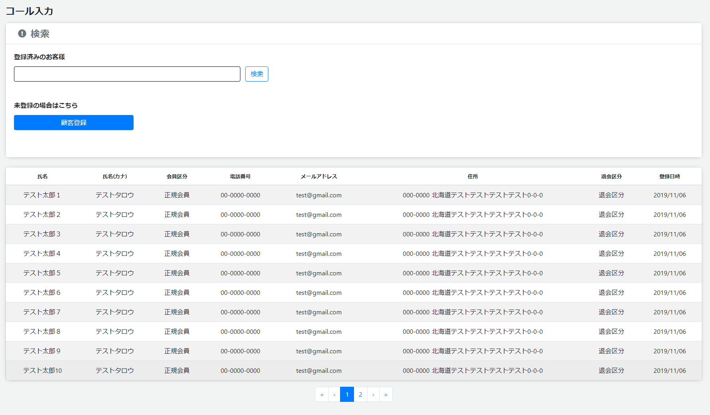

# 顧客特定
||
|:-:|

## Action

| Action No. | Action名 | 概要 | 画面 | 遷移先 | 中継API | 
| --- | --- | --- | --- | --- | --- |
| A | 顧客検索 | 条件から顧客検索を行う | 1 | own | [query.Query/queryCustomer_searchPOST](http://3.114.104.100/#/query.Query/queryCustomer_searchPOST) |
| B | 対応画面へ遷移 | 顧客を特定し対応画面へ遷移する | 2 | 対応履歴入力 | [] |
| C | 顧客登録画面へ遷移 | 顧客登録がない場合は顧客登録画面へ遷移する | 3 | 顧客登録 | [] |

## 中継API
### A: 顧客検索

| API名 | リンク |
| --- | --- |
| 顧客検索API | [query.Query/queryCustomer_searchPOST](http://3.114.104.100/#/query.Query/queryCustomer_searchPOST) |

#### Request

| 必須 | 物理名 | 型（桁） | 論理名(David) | 論理名（Prismatix） |
| --- | --- | --- | --- | --- |
|  | size(Excelなし) |  |  |  |
|  | from(Excelなし) |  |  |  |
|  | source_includes(Excelなし) |  |  |  |
|  | sort(Excelなし) |  |  |  |
|  | query(Excelなし) |  |  |  |
|  | query_fields(Excelなし) |  |  |  |

#### Response

| 必須 | 物理名 | 型（桁） | 論理名(David) | 論理名（Prismatix） |
| --- | --- | --- | --- | --- |
|  | hits[total] (Excelなし) |  |  |  |
|  | hits[hits][_source][customer_code] | string | 会員コード | 同左 |
|  | hits[hits][_source][name] (Excelなし) |  |  |  |
|  | hits[hits][_source][tel] | string | 電話番号(ハイフン無し) | 電話番号 |
|  | hits[hits][_source][contact_info_records][customer_code] | string | 会員コード | 同左 |
|  | hits[hits][_source][contact_info_records][contact_info_code] | string | 連絡先情報コード | 同左 |
|  | hits[hits][_source][contact_info_records][contact_info_nickname] | string | 連絡先情報ニックネーム | 同左 |
|  | hits[hits][_source][contact_info_records][contact_type] | string | 連絡方法 | 同左 |
|  | hits[hits][_source][contact_info_records][contact_token] | string | 連絡トークン | 同左 |
|  | hits[hits][_source][zip_code] | string | 郵便番号（ハイフンあり） | 郵便番号 |
|  | hits[hits][_source][country] | string | 国 | 同左 |
|  | hits[hits][_source][state] | string | 都道府県 | 同左 |
|  | hits[hits][_source][city] | string | 市区町村 | 市 |
|  | hits[hits][_source][address1] | string | 丁目・番地 | 住所 1 (地域/字) |
|  | hits[hits][_source][address2] | string | マンション・アパート建物名・会社名 | 住所 2 (番地/建物名) |
|  | hits[hits][_source][status] | string | 退会区分 | 会員ステータス |
|  | hits[hits][_source][register_timestamp] | integer | 登録タイムスタンプ | 同左 |

## 質問事項
| Action NO.| Request or Response | 質問内容 |
| ---| --- | --- |
| A | Response | hits[hits][_source][contact_info_records][contact_info_nickname] はどのExcelファイルを参照すれば良いのか(表にはポイント連絡先リソース20191101-01のものを記入したが恐らく参照するExcelファイルが違い、尚且つ参照するべきExcelファイルが存在しない)|
| A | Response | hits[hits][_source][contact_info_records][contact_type] はどのExcelファイルを参照すれば良いのか(表にはポイント連絡先リソース20191101-01のものを記入したが恐らく参照するExcelファイルが違い、尚且つ参照するべきExcelファイルが存在しない)|
| A | Response | hits[hits][_source][contact_info_records][contact_token] はどのExcelファイルを参照すれば良いのか(表にはポイント連絡先リソース20191101-01のものを記入したが恐らく参照するExcelファイルが違い、尚且つ参照するべきExcelファイルが存在しない)|

## 確認事項
* A: 顧客検索はResponseで会員区分(customer_type)は無いのか？