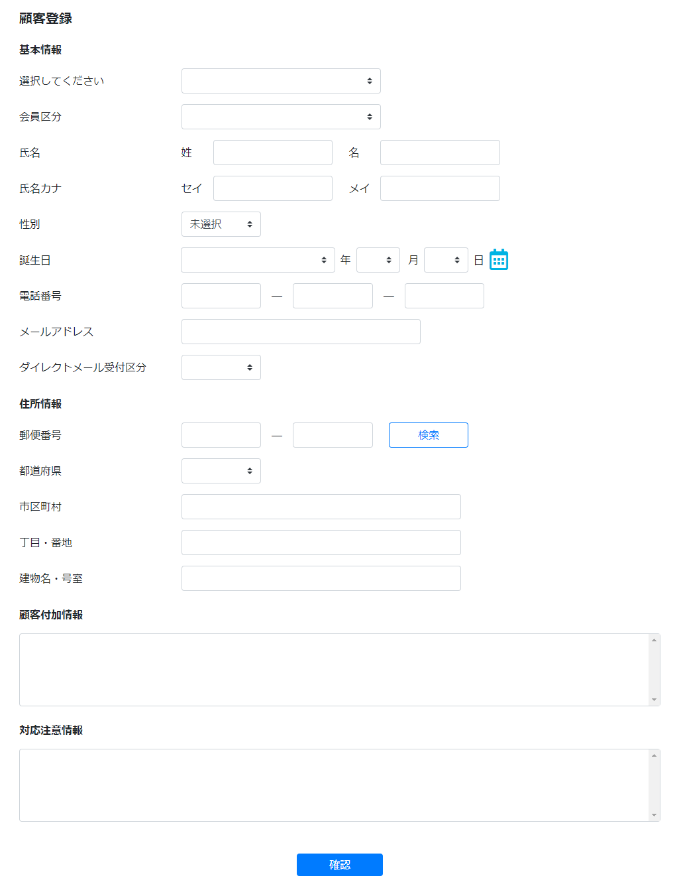

# 顧客登録
||
|:-:|

## Action

| Action No. | Action名 | 概要 | 画面 | 遷移先 | 中継API | 
| --- | --- | --- | --- | --- | --- |
| A | 顧客情報登録 | 顧客情報を登録する | 1 | own | order.Cart/post_carts |

## 中継API
### A: 顧客情報登録

| API名 | リンク |
| --- | --- |
| 顧客情報登録API | [customer.Customer/customersPOST](http://3.114.104.100/#/customer.Customer/customersPOST) |

#### Request

| 必須 | 物理名 | 型（桁） | 論理名(David) | 論理名（Prismatix） |
| --- | --- | --- | --- | --- |
| 〇 | customer_code | string | 会員コード | 同左 |
| 〇 | registered_flag | boolean | 認証システム登録済みフラグ | 同左 |
| 〇 | timezone | string | タイムゾーン | 同左 |
| 〇 | group_name | string | グループ名 | 同左 |
|  | attributes[customer_type] | string | 会員区分 | 会員タイプ |
|  | name[last_name_kanji] | string | 会員-姓 (漢字) | 姓 (漢字) |
|  | name[first_name_kanji] | string | 会員-名 (漢字) | 名 (漢字) |
|  | name[last_name_kana] | string | 会員-姓 (カナ) | 姓 (カナ) |
|  | name[first_name_kana] | string | 会員-名 (カナ) | 名 (カナ) |
|  | sex | string | 性別 | 同左 |
|  | birthday | number | 誕生日 | 誕生日タイムスタンプ |
|  | tel | string | 電話番号(ハイフン無し) | 電話番号 |
|  | contactInfoList[customer_code] | string | 会員コード | 同左 |
|  | contactInfoList[contact_info_code] | string | 連絡先情報コード | 同左 |
|  | contactInfoList[contact_info_nickname] | string | 連絡先情報ニックネーム | 同左 |
|  | contactInfoList[contact_type] | string | 連絡方法 | 同左 |
|  | contactInfoList[contact_token] | string | 連絡トークン | 同左 |
|  | country | string | 国 | 同左 |
|  | zip_code | string | 郵便番号（ハイフンあり） | 郵便番号 |
|  | state | string | 都道府県 | 同左 |
|  | city | string | 市区町村 | 市 |
|  | address1 | string | 丁目・番地 | 住所 1 (地域/字) |
|  | address2 | string | マンション・アパート建物名・会社名 | 住所 2 (番地/建物名) |
|  | delivery_company_code(Excelなし) |  |  |  |

#### Response

| 必須 | 物理名 | 型（桁） | 論理名(David) | 論理名（Prismatix） |
| --- | --- | --- | --- | --- |
|  | (status_code) |  |  |  |

## 質問事項
| Action NO.| Request or Response | 質問内容 |
| ---| --- | --- |
| A | Request | contactInfoList[customer_code] はどのExcelファイルを参照すれば良いのか(表にはポイント会員リソース20191127-01のものを記入したが恐らく参照するExcelファイルが違い、尚且つ参照するべきExcelファイルが存在しない)|
| A | Request | contactInfoList[contact_info_code] はどのExcelファイルを参照すれば良いのか(表にはポイント会員リソース20191127-01のものを記入したが恐らく参照するExcelファイルが違い、尚且つ参照するべきExcelファイルが存在しない)|
| A | Request | contactInfoList[contact_info_nickname] はどのExcelファイルを参照すれば良いのか(表にはポイント連絡先リソース20191101-01のものを記入したが恐らく参照するExcelファイルが違い、尚且つ参照するべきExcelファイルが存在しない)|
| A | Request | contactInfoList[contact_type] はどのExcelファイルを参照すれば良いのか(表にはポイント連絡先リソース20191101-01のものを記入したが恐らく参照するExcelファイルが違い、尚且つ参照するべきExcelファイルが存在しない)|
| A | Request | contactInfoList[contact_token] はどのExcelファイルを参照すれば良いのか(表にはポイント連絡先リソース20191101-01のものを記入したが恐らく参照するExcelファイルが違い、尚且つ参照するべきExcelファイルが存在しない)|

## 確認事項
* ダイレクトメール受付区分を登録するのはどのAPI？
* 顧客付加情報を登録するのはどのAPI？
* 対応注意情報を登録するのはどのAPI？