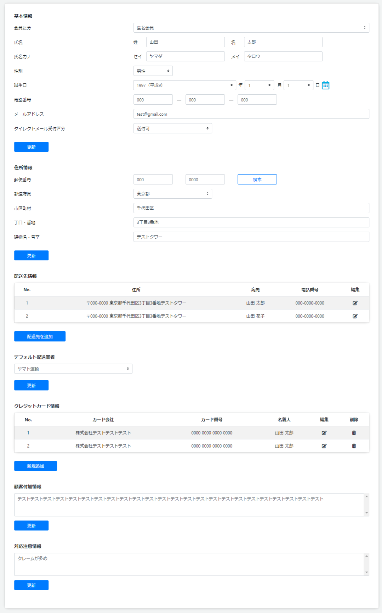
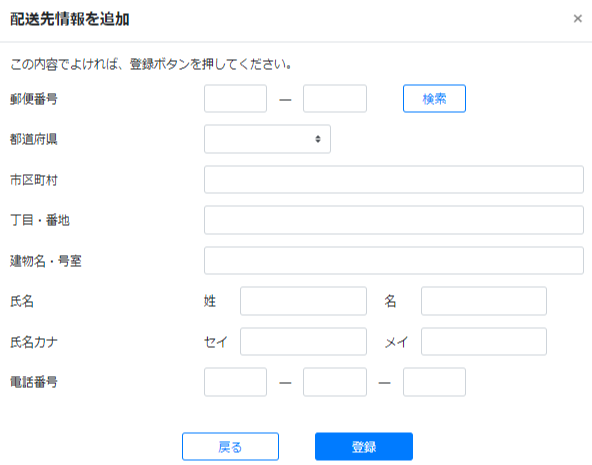
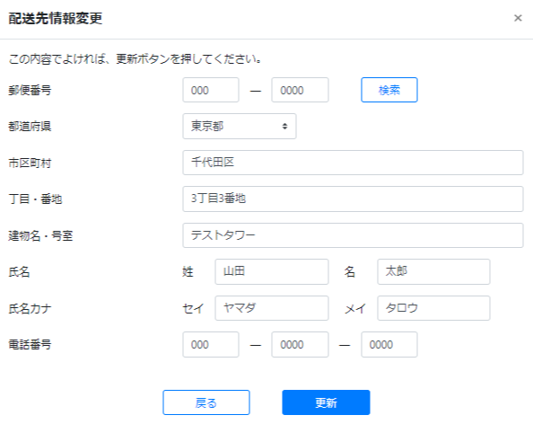

# 顧客情報修正
全体  

||
|:-:|

配送先追加ボタン押下後モーダル  

||
|:-:|

配送先編集ボタン押下後モーダル  

||
|:-:|

## Action

| Action No. | Action名 | 概要 | 画面 | 遷移先 | 中継API | 
| --- | --- | --- | --- | --- | --- |
| A | 顧客情報取得 | 顧客情報を取得する | 1 | own | [customer.Customer/customersCustomer_codeGET](http://3.114.104.100/#/customer.Customer/customersCustomer_codeGET) |
| B | クレジットカード一覧取得 | 登録しているクレジットカード一覧を取得する | 1 | own | [customer.Card/cards_by_customerCustomer_codeGET](http://3.114.104.100/#/customer.Card/cards_by_customerCustomer_codeGET) |
| C | 基本情報更新 | 基本情報で更新ボタン押下時、基本情報を更新する | 1 | own | [customer.Customer/customersCustomer_codePATCH](http://3.114.104.100/#/customer.Customer/customersCustomer_codePATCH) |
| D | 住所情報更新 | 住所情報で更新ボタン押下時、住所情報を更新する | 1 | own | [customer.Customer/customersCustomer_codePATCH](http://3.114.104.100/#/customer.Customer/customersCustomer_codePATCH) |
| E | デフォルト配送業者更新 | デフォルト配送業者で更新ボタン押下時、デフォルト配送業者を更新する | 1 | own | [customer.Customer/customersCustomer_codePATCH](http://3.114.104.100/#/customer.Customer/customersCustomer_codePATCH) |
| F | 配送先情報取得 | 配送先一覧押下時、現在登録している配送先情報を取得する | 1 | own | [customer.DeliveryInfo/customersCustomer_codeDelivery_infoDelivery_info_codeGET](http://3.114.104.100/#/customer.DeliveryInfo/customersCustomer_codeDelivery_infoDelivery_info_codeGET) |
| G | 配送先情報変更 | 編集ボタン押下時、現在登録している配送先情報を変更する | 1 | own | [customer.DeliveryInfo/customersCustomer_codeDelivery_infoDelivery_info_codePUT](http://3.114.104.100/#/customer.DeliveryInfo/customersCustomer_codeDelivery_infoDelivery_info_codePUT) |
| H | 配送先情報追加 | 配送先追加ボタン押下時、配送先を追加する | 1 | own | [customer.DeliveryInfo/customersCustomer_codeDelivery_infoPOST](http://3.114.104.100/#/customer.DeliveryInfo/customersCustomer_codeDelivery_infoPOST) |
| I | 配送先情報削除 | 削除ボタン押下時、配送先情報を削除する | 1 | own | [customer.DeliveryInfo/customersCustomer_codeDelivery_infoDelivery_info_codeDELETE](http://3.114.104.100/#/customer.DeliveryInfo/customersCustomer_codeDelivery_infoDelivery_info_codeDELETE) |
| J | クレジットカード変更 | 編集ボタン押下時、現在登録しているクレジットカードを変更する | 1 | own | [customer.Card/cardsCard_codePOST](http://3.114.104.100/#/customer.Card/cardsCard_codePOST) |
| K | クレジットカード追加 | 新規追加ボタン押下時、クレジットカードを追加する | 1 | own | [customer.Card/cardsPOST](http://3.114.104.100/#/customer.Card/cardsPOST) |
| L | クレジットカード削除 | 削除マーク押下時、クレジットカードを削除する | 1 | own | [customer.Card/cardsCard_codeDELETE](http://3.114.104.100/#/customer.Card/cardsCard_codeDELETE) |

## 中継API
### A: 顧客情報取得

| API名 | リンク |
| --- | --- |
| 顧客情報取得API | [customer.Customer/customersCustomer_codeGET](http://3.114.104.100/#/customer.Customer/customersCustomer_codeGET) |

#### Request

| 必須 | 物理名 | 型（桁） | 論理名(David) | 論理名（Prismatix） |
| --- | --- | --- | --- | --- |
| 〇 | customer_code | string | 会員コード | 同左 |

#### Response

| 必須 | 物理名 | 型（桁） | 論理名(David) | 論理名（Prismatix） |
| --- | --- | --- | --- | --- |
| 〇 | registered_flag | boolean | 認証システム登録済みフラグ | 同左 |
|  | attributes[customer_type] | string | 会員区分 | 会員タイプ |
|  | name[last_name_kanji] | string | 会員-姓 (漢字) | 姓 (漢字) |
|  | name[first_name_kanji] | string | 会員-名 (漢字) | 名 (漢字) |
|  | name[last_name_kana] | string | 会員-姓 (カナ) | 姓 (カナ) |
|  | name[first_name_kana] | string | 会員-名 (カナ) | 名 (カナ) |
|  | sex | string | 性別 | 同左 |
|  | birthday | number | 誕生日 | 誕生日タイムスタンプ |
|  | tel | string | 電話番号(ハイフン無し) | 電話番号 |
|  | contactInfoList[customer_code] | string | 会員コード | 同左 |
|  | contactInfoList[contact_info_code] | string | 連絡先情報コード | 同左 |
|  | contactInfoList[contact_info_nickname] | string | 連絡先情報ニックネーム | 同左 |
|  | contactInfoList[contact_type] | string | 連絡方法 | 同左 |
|  | contactInfoList[contact_token] | string | 連絡トークン | 同左 |
|  | country | string | 国 | 同左 |
|  | zip_code | string | 郵便番号（ハイフンあり） | 郵便番号 |
|  | state | string | 都道府県 | 同左 |
|  | city | string | 市区町村 | 市 |
|  | address1 | string | 丁目・番地 | 住所 1 (地域/字) |
|  | address2 | string | マンション・アパート建物名・会社名 | 住所 2 (番地/建物名) |
|  | deliveryInfoList[customer_code] | string | 会員コード | 同左 |
|  | deliveryInfoList[delivery_info_code] | string | 配送先情報コード | 同左 |
|  | deliveryInfoList[delivery_info_nickname] | string | 配送先名 | 配送先情報ニックネーム |
|  | deliveryInfoList[zip_code] | string | 郵便番号（ハイフンあり） | 郵便番号 |
|  | deliveryInfoList[country] | string | 国 | 同左 |
|  | deliveryInfoList[state] | string | 都道府県/州 | 同左 |
|  | deliveryInfoList[city] | string | 市町村 | 同左 |
|  | deliveryInfoList[address1] | string | 住所 1 (地域/字) | 同左 |
|  | deliveryInfoList[address2] | string | 住所 2 (番地/建物名) | 同左 |
|  | deliveryInfoList[name][last_name_kanji] | string | 配送先-姓 (漢字) | 姓 (漢字) |
|  | deliveryInfoList[name][first_name_kanji] | string | 配送先-名 (漢字) | 名 (漢字) |
|  | deliveryInfoList[name][last_name_kana] | string | 配送先-姓 (カナ) | 姓 (カナ) |
|  | deliveryInfoList[name][first_name_kana] | string | 配送先-名 (カナ) | 名 (カナ) |
|  | deliveryInfoList[tel] | string | 電話番号(ハイフン無し) | 電話番号 |

### B: クレジットカード一覧取得

| API名 | リンク |
| --- | --- |
| クレジットカード一覧取得API | [customer.Card/cards_by_customerCustomer_codeGET](http://3.114.104.100/#/customer.Card/cards_by_customerCustomer_codeGET) |

#### Request

| 必須 | 物理名 | 型（桁） | 論理名(David) | 論理名（Prismatix） |
| --- | --- | --- | --- | --- |
| 〇 | customer_code | string | 会員コード | 同左 |

#### Response

| 必須 | 物理名 | 型（桁） | 論理名(David) | 論理名（Prismatix） |
| --- | --- | --- | --- | --- |
|  | chunk[size] (Excelなし) |  |  |  |
|  | _embedded[subscriptions][card_code] (Excelなし) |  |  |  |
|  | _embedded[subscriptions][card_name] (Excelなし) |  |  |  |
|  | _embedded[subscriptions][customer_code] | string | 会員コード | 同左 |
|  | _embedded[subscriptions][payment_method_code] | string | 決済手段コード | 同左 |
|  | _embedded[subscriptions][masked_card_number] (Excelなし) |  |  |  |
|  | _embedded[subscriptions][native_card_id] (Excelなし) |  |  |  |
|  | _embedded[subscriptions][native_customer_id] (Excelなし) |  |  |  |

### C: 基本情報更新

| API名 | リンク |
| --- | --- |
| 基本情報更新API | [customer.Customer/customersCustomer_codePATCH](http://3.114.104.100/#/customer.Customer/customersCustomer_codePATCH) |

#### Request

| 必須 | 物理名 | 型（桁） | 論理名(David) | 論理名（Prismatix） |
| --- | --- | --- | --- | --- |
| 〇 | customer_code | string | 会員コード | 同左 |

#### Response

| 必須 | 物理名 | 型（桁） | 論理名(David) | 論理名（Prismatix） |
| --- | --- | --- | --- | --- |
|  | (status_code) |  |  |  |

### D: 住所情報更新

| API名 | リンク |
| --- | --- |
| 住所情報更新API | [customer.Customer/customersCustomer_codePATCH](http://3.114.104.100/#/customer.Customer/customersCustomer_codePATCH) |

#### Request

| 必須 | 物理名 | 型（桁） | 論理名(David) | 論理名（Prismatix） |
| --- | --- | --- | --- | --- |
| 〇 | customer_code | string | 会員コード | 同左 |

#### Response

| 必須 | 物理名 | 型（桁） | 論理名(David) | 論理名（Prismatix） |
| --- | --- | --- | --- | --- |
|  | (status_code) |  |  |  |

### E: デフォルト配送業者更新

| API名 | リンク |
| --- | --- |
| デフォルト配送業者更新API | [customer.Customer/customersCustomer_codePATCH](http://3.114.104.100/#/customer.Customer/customersCustomer_codePATCH) |

#### Request

| 必須 | 物理名 | 型（桁） | 論理名(David) | 論理名（Prismatix） |
| --- | --- | --- | --- | --- |
| 〇 | customer_code | string | 会員コード | 同左 |

#### Response

| 必須 | 物理名 | 型（桁） | 論理名(David) | 論理名（Prismatix） |
| --- | --- | --- | --- | --- |
|  | (status_code) |  |  |  |

### F: 配送先情報取得

| API名 | リンク |
| --- | --- |
| 配送先情報取得API | [customer.DeliveryInfo/customersCustomer_codeDelivery_infoDelivery_info_codeGET](http://3.114.104.100/#/customer.DeliveryInfo/customersCustomer_codeDelivery_infoDelivery_info_codeGET) |

#### Request

| 必須 | 物理名 | 型（桁） | 論理名(David) | 論理名（Prismatix） |
| --- | --- | --- | --- | --- |
| 〇 | customer_code | string | 会員コード | 同左 |
| 〇 | delivery_info_code | string | 配送先情報コード | 同左 |

#### Response

| 必須 | 物理名 | 型（桁） | 論理名(David) | 論理名（Prismatix） |
| --- | --- | --- | --- | --- |
| 〇 | delivery_info_nickname | string | 配送先名 | 配送先情報ニックネーム |
| 〇 | zip_code | string | 郵便番号（ハイフンあり） | 郵便番号 |
| 〇 | country | string | 国 | 同左 |
| 〇 | state | string | 都道府県/州 | 同左 |
| 〇 | city | string | 市町村 | 同左 |
| 〇 | address1 | string | 住所 1 (地域/字) | 同左 |
| 〇 | address2 | string | 住所 2 (番地/建物名) | 同左 |
| 〇 | name[last_name_kanji] | string | 配送先-姓 (漢字) | 姓 (漢字) |
| 〇 | name[first_name_kanji] | string | 配送先-名 (漢字) | 名 (漢字) |
| 〇 | name[last_name_kana] | string | 配送先-姓 (カナ) | 姓 (カナ) |
| 〇 | name[first_name_kana] | string | 配送先-名 (カナ) | 名 (カナ) |
|  | tel | string | 電話番号(ハイフン無し) | 電話番号 |

### G: 配送先情報変更

| API名 | リンク |
| --- | --- |
| 配送先情報変更API | [customer.DeliveryInfo/customersCustomer_codeDelivery_infoDelivery_info_codePUT](http://3.114.104.100/#/customer.DeliveryInfo/customersCustomer_codeDelivery_infoDelivery_info_codePUT) |

#### Request

| 必須 | 物理名 | 型（桁） | 論理名(David) | 論理名（Prismatix） |
| --- | --- | --- | --- | --- |
| 〇 | customer_code | string | 会員コード | 同左 |
| 〇 | delivery_info_code | string | 配送先情報コード | 同左 |
| 〇 | delivery_info_nickname | string | 配送先名 | 配送先情報ニックネーム |
| 〇 | zip_code | string | 郵便番号（ハイフンあり） | 郵便番号 |
| 〇 | country | string | 国 | 同左 |
| 〇 | state | string | 都道府県/州 | 同左 |
| 〇 | city | string | 市町村 | 同左 |
| 〇 | address1 | string | 住所 1 (地域/字) | 同左 |
| 〇 | address2 | string | 住所 2 (番地/建物名) | 同左 |
| 〇 | name[last_name_kanji] | string | 配送先-姓 (漢字) | 姓 (漢字) |
| 〇 | name[first_name_kanji] | string | 配送先-名 (漢字) | 名 (漢字) |
| 〇 | name[last_name_kana] | string | 配送先-姓 (カナ) | 姓 (カナ) |
| 〇 | name[first_name_kana] | string | 配送先-名 (カナ) | 名 (カナ) |
|  | tel | string | 電話番号(ハイフン無し) | 電話番号 |

#### Response

| 必須 | 物理名 | 型（桁） | 論理名(David) | 論理名（Prismatix） |
| --- | --- | --- | --- | --- |
|  | (status_code) |  |  |  |

### H: 配送先情報追加

| API名 | リンク |
| --- | --- |
| 配送先情報追加API | [customer.DeliveryInfo/customersCustomer_codeDelivery_infoPOST](http://3.114.104.100/#/customer.DeliveryInfo/customersCustomer_codeDelivery_infoPOST) |

#### Request

| 必須 | 物理名 | 型（桁） | 論理名(David) | 論理名（Prismatix） |
| --- | --- | --- | --- | --- |
| 〇 | customer_code | string | 会員コード | 同左 |
| 〇 | delivery_info_code | string | 配送先情報コード | 同左 |
| 〇 | delivery_info_nickname | string | 配送先名 | 配送先情報ニックネーム |
| 〇 | zip_code | string | 郵便番号（ハイフンあり） | 郵便番号 |
| 〇 | country | string | 国 | 同左 |
| 〇 | state | string | 都道府県/州 | 同左 |
| 〇 | city | string | 市町村 | 同左 |
| 〇 | address1 | string | 住所 1 (地域/字) | 同左 |
| 〇 | address2 | string | 住所 2 (番地/建物名) | 同左 |
| 〇 | name[last_name_kanji] | string | 配送先-姓 (漢字) | 姓 (漢字) |
| 〇 | name[first_name_kanji] | string | 配送先-名 (漢字) | 名 (漢字) |
| 〇 | name[last_name_kana] | string | 配送先-姓 (カナ) | 姓 (カナ) |
| 〇 | name[first_name_kana] | string | 配送先-名 (カナ) | 名 (カナ) |
|  | tel | string | 電話番号(ハイフン無し) | 電話番号 |

#### Response

| 必須 | 物理名 | 型（桁） | 論理名(David) | 論理名（Prismatix） |
| --- | --- | --- | --- | --- |
|  | (status_code) |  |  |  |

### I: 配送先情報削除

| API名 | リンク |
| --- | --- |
| 配送先情報削除API | [customer.DeliveryInfo/customersCustomer_codeDelivery_infoDelivery_info_codeDELETE](http://3.114.104.100/#/customer.DeliveryInfo/customersCustomer_codeDelivery_infoDelivery_info_codeDELETE) |

#### Request

| 必須 | 物理名 | 型（桁） | 論理名(David) | 論理名（Prismatix） |
| --- | --- | --- | --- | --- |
| 〇 | customer_code | string | 会員コード | 同左 |
| 〇 | delivery_info_code | string | 配送先情報コード | 同左 |

#### Response

| 必須 | 物理名 | 型（桁） | 論理名(David) | 論理名（Prismatix） |
| --- | --- | --- | --- | --- |
|  | (status_code) |  |  |  |

### J: クレジットカード変更

| API名 | リンク |
| --- | --- |
| クレジットカード変更API | [customer.Card/cardsCard_codePOST](http://3.114.104.100/#/customer.Card/cardsCard_codePOST) |

#### Request

| 必須 | 物理名 | 型（桁） | 論理名(David) | 論理名（Prismatix） |
| --- | --- | --- | --- | --- |
| 〇 | card_code(Excelなし) |  |  |  |
| 〇 | card_name(Excelなし) |  |  |  |
| 〇 | customer_code | string | 会員コード | 同左 |
| 〇 | payment_method_code | string | 決済手段コード | 同左 |
| 〇 | token(Excelなし) |  |  |  |

#### Response

| 必須 | 物理名 | 型（桁） | 論理名(David) | 論理名（Prismatix） |
| --- | --- | --- | --- | --- |
|  | (status_code) |  |  |  |

### K: クレジットカード追加

| API名 | リンク |
| --- | --- |
| クレジットカード追加API | [customer.Card/cardsPOST](http://3.114.104.100/#/customer.Card/cardsPOST) |

#### Request

| 必須 | 物理名 | 型（桁） | 論理名(David) | 論理名（Prismatix） |
| --- | --- | --- | --- | --- |
| 〇 | card_code(Excelなし) |  |  |  |
| 〇 | card_name(Excelなし) |  |  |  |
| 〇 | customer_code | string | 会員コード | 同左 |
| 〇 | payment_method_code | string | 決済手段コード | 同左 |
| 〇 | token(Excelなし) |  |  |  |

#### Response

| 必須 | 物理名 | 型（桁） | 論理名(David) | 論理名（Prismatix） |
| --- | --- | --- | --- | --- |
|  | (status_code) |  |  |  |

### L: クレジットカード削除

| API名 | リンク |
| --- | --- |
| クレジットカード削除API | [customer.Card/cardsCard_codeDELETE](http://3.114.104.100/#/customer.Card/cardsCard_codeDELETE) |

#### Request

| 必須 | 物理名 | 型（桁） | 論理名(David) | 論理名（Prismatix） |
| --- | --- | --- | --- | --- |
| 〇 | card_code(Excelなし) |  |  |  |

#### Response

| 必須 | 物理名 | 型（桁） | 論理名(David) | 論理名（Prismatix） |
| --- | --- | --- | --- | --- |
|  | (status_code) |  |  |  |

## 質問事項
| Action NO.| Request or Response | 質問内容 |
| ---| --- | --- |
| A | Response | contactInfoList[customer_code] はどのExcelファイルを参照すれば良いのか(表にはポイント会員リソース20191127-01のものを記入したが恐らく参照するExcelファイルが違い、尚且つ参照するべきExcelファイルが存在しない)|
| A | Response | contactInfoList[contact_info_code] はどのExcelファイルを参照すれば良いのか(表にはポイント会員リソース20191127-01のものを記入したが恐らく参照するExcelファイルが違い、尚且つ参照するべきExcelファイルが存在しない)|
| A | Response | contactInfoList[contact_info_nickname] はどのExcelファイルを参照すれば良いのか(表にはポイント連絡先リソース20191101-01のものを記入したが恐らく参照するExcelファイルが違い、尚且つ参照するべきExcelファイルが存在しない)|
| A | Response | contactInfoList[contact_type] はどのExcelファイルを参照すれば良いのか(表にはポイント連絡先リソース20191101-01のものを記入したが恐らく参照するExcelファイルが違い、尚且つ参照するべきExcelファイルが存在しない)|
| A | Response | contactInfoList[contact_token] はどのExcelファイルを参照すれば良いのか(表にはポイント連絡先リソース20191101-01のものを記入したが恐らく参照するExcelファイルが違い、尚且つ参照するべきExcelファイルが存在しない)|
| A | Response | deliveryInfoList[customer_code] はどのExcelファイルを参照すれば良いのか(表には配送先リソース_20191101-01のものを記入したが恐らく参照するExcelファイルが違い、尚且つ参照するべきExcelファイルが存在しない) |
| A | Response | deliveryInfoList[delivery_info_code] はどのExcelファイルを参照すれば良いのか(表には配送先リソース_20191101-01のものを記入したが恐らく参照するExcelファイルが違い、尚且つ参照するべきExcelファイルが存在しない) |
| A | Response | deliveryInfoList[delivery_info_nickname] はどのExcelファイルを参照すれば良いのか(表には配送先リソース_20191101-01のものを記入したが恐らく参照するExcelファイルが違い、尚且つ参照するべきExcelファイルが存在しない) |
| A | Response | deliveryInfoList[lang] はどのExcelファイルを参照すれば良いのか(表には配送先リソース_20191101-01のものを記入したが恐らく参照するExcelファイルが違い、尚且つ参照するべきExcelファイルが存在しない) |
| A | Response | deliveryInfoList[zip_code] はどのExcelファイルを参照すれば良いのか(表には配送先リソース_20191101-01のものを記入したが恐らく参照するExcelファイルが違い、尚且つ参照するべきExcelファイルが存在しない) |
| A | Response | delivery_address[country] はどのExcelファイルを参照すれば良いのか(表には配送先リソース_20191101-01のものを記入したが恐らく参照するExcelファイルが違い、尚且つ参照するべきExcelファイルが存在しない) |
| A | Response | delivery_address[state] はどのExcelファイルを参照すれば良いのか(表には配送先リソース_20191101-01のものを記入したが恐らく参照するExcelファイルが違い、尚且つ参照するべきExcelファイルが存在しない) |
| A | Response | deliveryInfoList[city] はどのExcelファイルを参照すれば良いのか(表には配送先リソース_20191101-01のものを記入したが恐らく参照するExcelファイルが違い、尚且つ参照するべきExcelファイルが存在しない) |
| A | Response | deliveryInfoList[address1] はどのExcelファイルを参照すれば良いのか(表には配送先リソース_20191101-01のものを記入したが恐らく参照するExcelファイルが違い、尚且つ参照するべきExcelファイルが存在しない) |
| A | Response | deliveryInfoList[address2] はどのExcelファイルを参照すれば良いのか(表には配送先リソース_20191101-01のものを記入したが恐らく参照するExcelファイルが違い、尚且つ参照するべきExcelファイルが存在しない) |
| A | Response | deliveryInfoList[name][last_name_kanji] はどのExcelファイルを参照すれば良いのか(表には配送先リソース_20191101-01のものを記入したが恐らく参照するExcelファイルが違い、尚且つ参照するべきExcelファイルが存在しない) |
| A | Response | deliveryInfoList[name][first_name_kanji] はどのExcelファイルを参照すれば良いのか(表には配送先リソース_20191101-01のものを記入したが恐らく参照するExcelファイルが違い、尚且つ参照するべきExcelファイルが存在しない) |
| A | Response | deliveryInfoList[name][last_name_kana] はどのExcelファイルを参照すれば良いのか(表には配送先リソース_20191101-01のものを記入したが恐らく参照するExcelファイルが違い、尚且つ参照するべきExcelファイルが存在しない) |
| A | Response | deliveryInfoList[name][first_name_kana] はどのExcelファイルを参照すれば良いのか(表には配送先リソース_20191101-01のものを記入したが恐らく参照するExcelファイルが違い、尚且つ参照するべきExcelファイルが存在しない) |
| A | Response | deliveryInfoList[tel] はどのExcelファイルを参照すれば良いのか(表には配送先リソース_20191101-01のものを記入したが恐らく参照するExcelファイルが違い、尚且つ参照するべきExcelファイルが存在しない) |
| B | Response | _embedded[subscriptions][customer_code] はどのExcelファイルを参照すれば良いのか(表には会員リソース20191127-01のものを記入したが恐らく参照するExcelファイルが違い、尚且つ参照するべきExcelファイルが存在しない)
| B | Response | _embedded[subscriptions][payment_method_code] はどのExcelファイルを参照すれば良いのか(表には決済手段リソース20191024-01のものを記入したが恐らく参照するExcelファイルが違い、尚且つ参照するべきExcelファイルが存在しない)
| J | Request | customer_code はどのExcelファイルを参照すれば良いのか(表には会員リソース20191127-01のものを記入したが恐らく参照するExcelファイルが違い、尚且つ参照するべきExcelファイルが存在しない)
| J | Request | payment_method_code はどのExcelファイルを参照すれば良いのか(表には決済手段リソース20191024-01のものを記入したが恐らく参照するExcelファイルが違い、尚且つ参照するべきExcelファイルが存在しない)
| K | Request | customer_code はどのExcelファイルを参照すれば良いのか(表には会員リソース20191127-01のものを記入したが恐らく参照するExcelファイルが違い、尚且つ参照するべきExcelファイルが存在しない)
| K | Request | payment_method_code はどのExcelファイルを参照すれば良いのか(表には決済手段リソース20191024-01のものを記入したが恐らく参照するExcelファイルが違い、尚且つ参照するべきExcelファイルが存在しない)

## 確認事項
* 顧客情報取得でデフォルト配送業者を取得することができない。登録ではできていたので取得で取れるはず
* customer.Customer/customersCustomer_codePATCH は Request で customer_code 以外投げることはできないのか。(項目が足りない)？
* ダイレクトメール受付区分を取得するのはどのAPI？
* 顧客付加情報を取得するのはどのAPI？
* 対応注意情報を取得するのはどのAPI？
* K: クレジットカード追加で、Requestで投げる値としてmasked_card_numberやnative_card_id、native_customer_idは無くて良いのか？