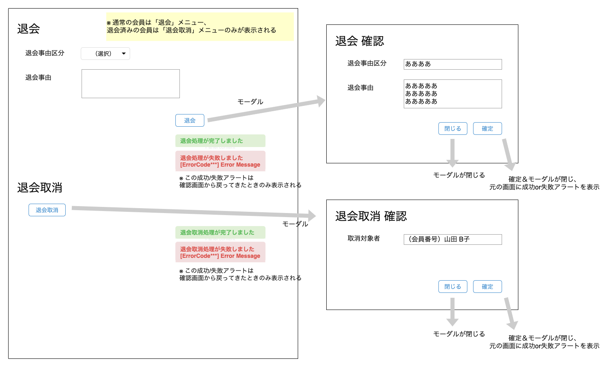

# 退会
||  
|:-:|

## Action

| Action No. | Action名 | 概要 | 画面 | 遷移先 | 中継API | 
| --- | --- | --- | --- | --- | --- |
| A | 会員退会 | 会員を退会させる | 1 | own | [customer.Customer/customersCustomer_code_leavePOST](http://3.114.104.100/#/customer.Customer/customersCustomer_code_leavePOST) |

## 中継API
### A: 会員退会

| API名 | リンク |
| --- | --- |
| 会員退会API | [customer.Customer/customersCustomer_code_leavePOST](http://3.114.104.100/#/customer.Customer/customersCustomer_code_leavePOST) |

#### Request

| 必須 | 物理名 | 型（桁） | 論理名(David) | 論理名（Prismatix） |
| ---| --- | --- | --- | --- |
| 〇 | customer_code | string | 会員コード | 同左 |
| 〇 | resignation_reason(Excelなし) |  |  |  |
|  | status | string | 退会区分 | 会員ステータス |

#### Response

| 必須 | 物理名 | 型（桁） | 論理名(David) | 論理名（Prismatix） |
| --- | --- | --- | --- | --- |
|  | (status_code) |  |  |  |