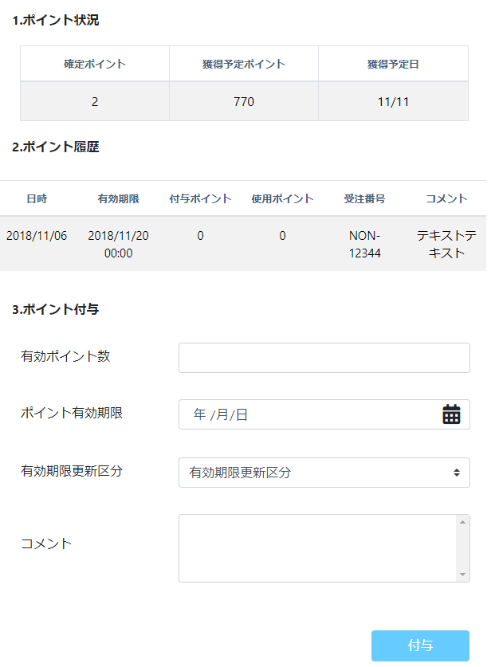

# ポイント
||  
|:-:|

## Action

| Action No. | Action名 | 概要 | 画面 | 遷移先 | 中継API | 
| --- | --- | --- | --- | --- | --- |
| A | 会員のポイント状況を取得する | 保持ポイント一覧、期間合計ポイント、利用可能ポイントを取得する | 1 | own | [point.Point/customer_points_by_customerCustomer_codeGET](http://3.114.104.100/#/point.Point/customer_points_by_customerCustomer_codeGET) |
| B | 会員のポイント履歴を取得・検索する | | 4 | own | [point.Point/getOrderById](http://3.114.104.100/#/point.Point/getOrderById) |
| C | ポイントを発行する | ポイントを発行する | 2 | own | [point.Point/points_issuePOST](http://3.114.104.100/#/point.Point/points_issuePOST) |
| D | 発行したポイントをキャンセルする | 発行したポイントをキャンセルする | 3 | own | [point.Point/pointsPoint_history_code_cancelPATCH](http://3.114.104.100/#/point.Point/pointsPoint_history_code_cancelPATCH) |

## 中継API
### A: 会員のポイント状況を取得する

| API名 | リンク |
| --- | --- |
| ポイント状況取得API | [point.Point/customer_points_by_customerCustomer_codeGET](http://3.114.104.100/#/point.Point/customer_points_by_customerCustomer_codeGET) |

#### Request

| 必須 | 物理名 | 型（桁） | 論理名(David) | 論理名（Prismatix） |
| --- | --- | --- | --- | --- |
| 〇 | customer_code | string | 会員コード | 同左 |

#### Response

| 必須 | 物理名 | 型（桁） | 論理名(David) | 論理名（Prismatix） |
| --- | --- | --- | --- | --- |
|  | total_available_point(Excelなし) |  |  |  |
|  | _embedded[customer_points][customer_point_code] (Excelなし) |  |  |  |
|  | _embedded[customer_points][point] | number | このポイント種類の獲得ポイント数 | 同左 |
|  | _embedded[customer_points][customer_point_type] (Excelなし) |  |  |  |
|  | _embedded[customer_points][issue_timestamp] (Excelなし) |  |  |  |
|  | _embedded[customer_points][start_timestamp] (Excelなし) |  |  |  |

### B: 会員のポイント履歴を取得・検索する

| API名 | リンク |
| --- | --- |
| ポイント履歴取得API | [point.Point/getOrderById](http://3.114.104.100/#/point.Point/getOrderById) |

#### Request

| 必須 | 物理名 | 型（桁） | 論理名(David) | 論理名（Prismatix） |
| --- | --- | --- | --- | --- |
| 〇 | customer_code | string | 会員コード | 同左 |
| 〇 | point_code | string | ポイント種類コード | 同左 |

#### Response

| 必須 | 物理名 | 型（桁） | 論理名(David) | 論理名（Prismatix） |
| --- | --- | --- | --- | --- |
| 〇 | status(Excelなし) |  |  |  |
|  | start_timestamp | integer | ポイント付与量適用開始時刻 | 同左 |
|  | end_timestamp | integer | ポイント付与量終了時刻 | 同左 |
|  | valid_time | number | このポイント種類の有効期間 | 同左 |
|  | point | number | このポイント種類の獲得ポイント数 | 同左 |
|  | point_variations[point_variation_code] | string | ポイント付与量コード | 同左 |
|  | point_variations[sku_code] | string | 単品コード | SKU コード |
|  | point_variations[point_variation_reason] | string | ポイント付与量変化理由 | 同左 |

### C: ポイントを発行する

| API名 | リンク |
| --- | --- |
| ポイント発行API | [point.Point/points_issuePOST](http://3.114.104.100/#/point.Point/points_issuePOST) |

#### Request

| 必須 | 物理名 | 型（桁） | 論理名(David) | 論理名（Prismatix） |
| --- | --- | --- | --- | --- |
| 〇 | point_code | string | ポイント種類コード | 同左 |
| 〇 | point_history_code(Excelなし) |  |  |  |
| 〇 | customer_point_code(Excelなし) |  |  |  |
| 〇 | customer_code | string | 会員コード | 同左 |
| 〇 | issue_timestamp(Excelなし) |  |  |  |
| 〇 | cause(Excelなし) |  |  |  |
|  | point | number | このポイント種類の獲得ポイント数 | 同左 |
|  | start_timestamp | integer | ポイント付与量適用開始時刻 | 同左 |
|  | end_timestamp | integer | ポイント付与量終了時刻 | 同左 |

#### Response

| 必須 | 物理名 | 型（桁） | 論理名(David) | 論理名（Prismatix） |
| --- | --- | --- | --- | --- |
|  | (status_code) |  |  |  |

### D: 発行したポイントをキャンセルする

| API名 | リンク |
| --- | --- |
| ポイントキャンセルAPI | [point.Point/pointsPoint_history_code_cancelPATCH](http://3.114.104.100/#/point.Point/pointsPoint_history_code_cancelPATCH) |

#### Request

| 必須 | 物理名 | 型（桁） | 論理名(David) | 論理名（Prismatix） |
| --- | --- | --- | --- | --- |
| 〇 | point_history_code(Excelなし) |  |  |  |

#### Response

| 必須 | 物理名 | 型（桁） | 論理名(David) | 論理名（Prismatix） |
| --- | --- | --- | --- | --- |
|  | (status_code) |  |  |  |

## 質問事項
| Action NO.| Request or Response | 質問内容 |
| ---| --- | --- |
| A | Response | _embedded[customer_points][point] はどのExcelファイルを参照すれば良いのか(表にはポイント種類リソース20191129-01のものを記入したが恐らく参照するExcelファイルが違い、尚且つ参照するべきExcelファイルが存在しない)|
| B | Response | point_variations[point_variation_code] はどのExcelファイルを参照すれば良いのか(表にはポイント付与量リソース20191111-01のものを記入したが恐らく参照するExcelファイルが違い、尚且つ参照するべきExcelファイルが存在しない)|
| B | Response | point_variations[sku_code] はどのExcelファイルを参照すれば良いのか(表にはポイント付与量リソース20191111-01のものを記入したが恐らく参照するExcelファイルが違い、尚且つ参照するべきExcelファイルが存在しない)|
| B | Response | point_variations[point_variation_reason] はどのExcelファイルを参照すれば良いのか(表にはポイント付与量リソース20191111-01のものを記入したが恐らく参照するExcelファイルが違い、尚且つ参照するべきExcelファイルが存在しない)|

## 確認事項
* 発行したポイントを変更した場合はキャンセル->再発行？（修正APIはない？）  
* A: 会員のポイント状況を取得 の_embedded配下はおそらくポイントの種別に関する情報なので必要ない？