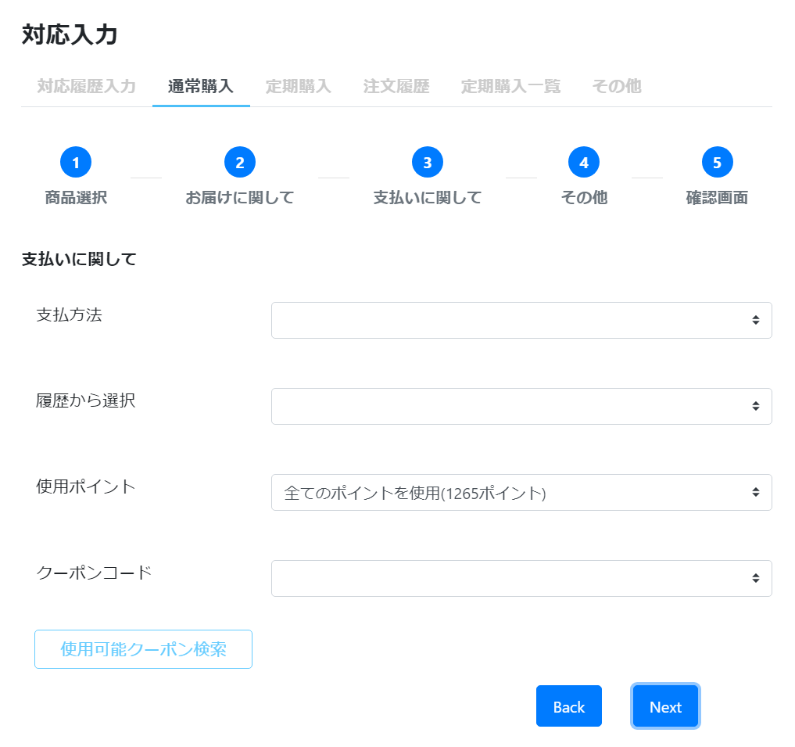

# 通常購入: Step3 支払い
||  
|:-:|

## Action

| Action No. | Action名 | 概要 | 画面 | 遷移先 | 中継API | 
| --- | --- | --- | --- | --- | --- |
| A | 顧客のクレジットカード一覧を取得 | 指定したcustomer_codeに紐づくカード一覧を取得する | 1 | own | [customer.Card/get_cards__by_customer__customer_code_](http://3.114.104.100/#/customer.Card/get_cards__by_customer__customer_code_)|
| B | クレジットカード登録 | | 1 | own | |
| C | クレジットカード更新 | | 1 | own | |
| D | クレジットカード削除 | | 1 | own | |
| E | ポイント一覧取得 | 保持ポイント一覧、期間合計ポイント、利用可能ポイントを取得する | 1 | own | [point.Point/get_customer_points__by_customer__customer_code_](http://3.114.104.100/#/point.Point/get_customer_points__by_customer__customer_code_) |
| F | ポイント使用 | カートに使用ポイントを登録する | 1 | own | [order.Cart/post_carts__cart_code___update__point](http://3.114.104.100/#/order.Cart/post_carts__cart_code___update__point) |
| G | クーポン一覧取得 | 会員の発行済クーポンの一覧を取得する | 1 | own | [order.Coupon/get_issued_coupons__by_customer__customer_code_](http://3.114.104.100/#/order.Coupon/get_issued_coupons__by_customer__customer_code_) |
| H | クーポン利用 | クーポンを利用する | 1 | own | [order.Coupon/post_issued_coupons__issued_coupon_code___use](http://3.114.104.100/#/order.Coupon/post_issued_coupons__issued_coupon_code___use) |

## 中継API
### A: 顧客のクレジットカード一覧を取得

| API名 | リンク |
| --- | --- |
| クレジットカード一覧取得API | [customer.Card/get_cards__by_customer__customer_code_](http://3.114.104.100/#/customer.Card/get_cards__by_customer__customer_code_) |

#### Request

| 必須 | 物理名 | 型（桁） | 論理名(David) | 論理名（Prismatix） |
| --- | --- | --- | --- | --- |
| 〇 | customer_code | string | 会員コード | 同左 |

#### Response

| 必須 | 物理名 | 型（桁） | 論理名(David) | 論理名（Prismatix） |
| --- | --- | --- | --- | --- |
|  | chunk[size] (Excelなし) |  |  |  |
|  | _embedded[subscriptions][card_code] (Excelなし) |  |  |  |
|  | _embedded[subscriptions][card_name] (Excelなし) |  |  |  |
|  | _embedded[subscriptions][customer_code] | string | 会員コード | 同左 |
|  | _embedded[subscriptions][payment_method_code] | string | 決済手段コード | 同左 |
|  | _embedded[subscriptions][masked_card_number] (Excelなし) |  |  |  |
|  | _embedded[subscriptions][native_card_id] (Excelなし) |  |  |  |
|  | _embedded[subscriptions][native_customer_id] (Excelなし) |  |  |  |

### E: ポイント一覧取得

| API名 | リンク |
| --- | --- |
| ポイント一覧取得API | [point.Point/get_customer_points__by_customer__customer_code_](http://3.114.104.100/#/point.Point/get_customer_points__by_customer__customer_code_) |

#### Request

| 必須 | 物理名 | 型（桁） | 論理名(David) | 論理名（Prismatix） |
| --- | --- | --- | --- | --- |
| 〇 | customer_code | string | 会員コード | 同左 |

#### Response

| 必須 | 物理名 | 型（桁） | 論理名(David) | 論理名（Prismatix） |
| --- | --- | --- | --- | --- |
|  | total_limited_point(Excelなし) |  |  |  |
|  | total_available_point(Excelなし) |  |  |  |
|  | chunk[size] (Excelなし) |  |  |  |

### F: ポイント使用

| API名 | リンク |
| --- | --- |
| 利用ポイント登録API | [order.Cart/post_carts__cart_code___update__point](http://3.114.104.100/#/order.Cart/post_carts__cart_code___update__point) |

#### Request

| 必須 | 物理名 | 型（桁） | 論理名(David) | 論理名（Prismatix） |
| --- | --- | --- | --- | --- |
| 〇 | cart_code(Excelなし) |  |  |  |

#### Response

| 必須 | 物理名 | 型（桁） | 論理名(David) | 論理名（Prismatix） |
| --- | --- | --- | --- | --- |
|  | (status_code) |  |  |  |

### G: クーポン一覧取得

| API名 | リンク |
| --- | --- |
| クーポン一覧取得API | [order.Coupon/get_issued_coupons__by_customer__customer_code_](http://3.114.104.100/#/order.Coupon/get_issued_coupons__by_customer__customer_code_) |

#### Request

| 必須 | 物理名 | 型（桁） | 論理名(David) | 論理名（Prismatix） |
| --- | --- | --- | --- | --- |
| 〇 | customer_code | string | 会員コード | 同左 |

#### Response

| 必須 | 物理名 | 型（桁） | 論理名(David) | 論理名（Prismatix） |
| --- | --- | --- | --- | --- |
|  | issued_coupon_code(Excelなし) |  |  |  |
|  | master_coupon_code(Excelなし) |  |  |  |
|  | use_start_timestamp(Excelなし) |  |  |  |
|  | use_end_timestamp(Excelなし) |  |  |  |
|  | remaining_number_of_uses(Excelなし) |  |  |  |
|  | limit_number_of_uses_per_customer(Excelなし) |  |  |  |
|  | discount_type(Excelなし) |  |  |  |
|  | currency_code | string | 通貨コード (ISO 4217 に準拠) | 同左 |
|  | minimum_total_price(Excelなし) |  |  |  |
|  | minimum_item_number(Excelなし) |  |  |  |
|  | applicable_sku_codes(Excelなし) |  |  |  |

### H: クーポン利用

| API名 | リンク |
| --- | --- |
| 利用クーポン登録API | [order.Coupon/post_issued_coupons__issued_coupon_code___use](http://3.114.104.100/#/order.Coupon/post_issued_coupons__issued_coupon_code___use) |

#### Request

| 必須 | 物理名 | 型（桁） | 論理名(David) | 論理名（Prismatix） |
| --- | --- | --- | --- | --- |
| 〇 | issued_coupon_code(Excelなし) |  |  |  |
| 〇 | cart_code(Excelなし) |  |  |  |
| 〇 | order_code(Excelなし) |  |  |  |
|  | coupon_used_timestamp(Excelなし) |  |  |  |

#### Response

| 必須 | 物理名 | 型（桁） | 論理名(David) | 論理名（Prismatix） |
| --- | --- | --- | --- | --- |
|  | (status_code) |  |  |  |
| 〇 | issued_coupon_code(Excelなし) |  |  |  |

## 質問事項
| Action NO.| Request or Response | 質問内容 |
| ---| --- | --- |
| A | Response | _embedded[subscriptions][customer_code] はどのExcelファイルを参照すれば良いのか(表には会員リソース20191127-01のものを記入したが恐らく参照するExcelファイルが違い、尚且つ参照するべきExcelファイルが存在しない)
| A | Response | _embedded[subscriptions][payment_method_code] はどのExcelファイルを参照すれば良いのか(表には決済手段リソース20191024-01のものを記入したが恐らく参照するExcelファイルが違い、尚且つ参照するべきExcelファイルが存在しない)
| G | Response | currency_code はどのExcelファイルを参照すれば良いのか(表には価格リソース20191126-01のものを記入)

## 確認事項
* カートに使用ポイントを登録する /carts/{cart_code}/_update/_point は、Prametersにポイントがないが、どのようにカートにポイントを登録するのか

* カートに支払い方法を登録するAPI /carts/{cart_code}/_update/_pay のRequestに支払い方法に関するものが無い