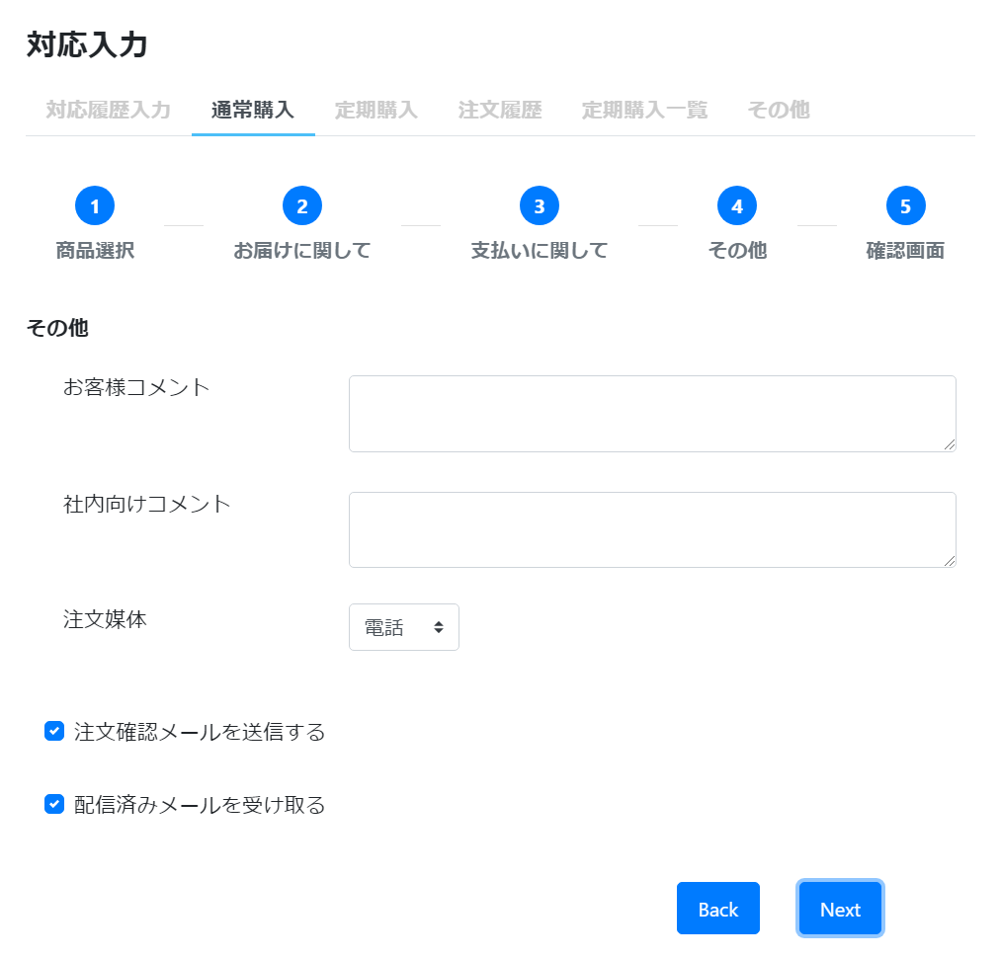

# 通常購入: Step4 その他
||  
|:-:|

## Action

| Action No. | Action名 | 概要 | 画面 | 遷移先 | 中継API | 
| --- | --- | --- | --- | --- | --- |
| A | メール送信依頼 | 注文確認メール、配信済みメールの送信依頼をする | 1 | own | [notification.MailActivity/post_mail__mail_template_code___send](http://3.114.104.100/#/notification.MailActivity/post_mail__mail_template_code___send) |

## 中継API
### A: メール送信依頼

| API名 | リンク |
| --- | --- |
| メール送信依頼API | [notification.MailActivity/post_mail__mail_template_code___send](http://3.114.104.100/#/notification.MailActivity/post_mail__mail_template_code___send) |

#### Request

| 必須 | 物理名 | 型（桁） | 論理名(David) | 論理名（Prismatix） |
| --- | --- | --- | --- | --- |
|  | mail_template_code(Excelなし) |  |  |  |
|  | sender(Excelなし) |  |  |  |
|  | to(Excelなし) |  |  |  |
|  | parameter(Excelなし) |  |  |  |

#### Response

| 必須 | 物理名 | 型（桁） | 論理名(David) | 論理名（Prismatix） |
| --- | --- | --- | --- |
| 〇 | status(Excelなし) |  |  |  |
| 〇 | mail_activity_code(Excelなし) |  |  |  |

## 確認事項
* お客様コメント取得のAPIは無いのか
* 注文媒体設定/carts/{cart_code}/_updateが無い