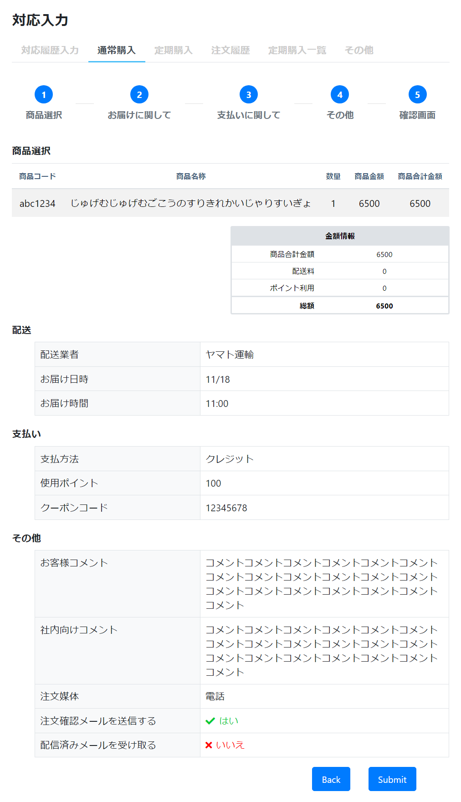

# 通常購入: 確認
||  
|:-:|

## Action

| Action No. | Action名 | 概要 | 画面 | 遷移先 | 中継API | 
| --- | --- | --- | --- | --- | --- |
| A | カート仮引当 | 仮引当を行う | 2 | own | [order.Cart/post_carts__cart_code___stage_checkout](http://3.114.104.100/#/order.Cart/post_carts__cart_code___stage_checkout) |
| B | 配送料・カート金額・還元ポイントを取得 | カートに関する情報を取得 | 2 | own | [order.Cart/post_carts__cart_code___calculate](http://3.114.104.100/#/order.Cart/post_carts__cart_code___calculate) |

## 中継API

### A: カート仮引当

| カート仮引当API名 | リンク |
| --- | --- |
| API | [order.Cart/post_carts__cart_code___stage_checkout](http://3.114.104.100/#/order.Cart/post_carts__cart_code___stage_checkout) |  

#### Request

| 必須 | 物理名 | 型（桁） | 論理名(David) | 論理名（Prismatix） |
| ---| --- | --- | --- | --- |
| 〇 | cart_code(Excelなし) |  |  |  |
|  | allocation_release_timestamp(Excelなし) |  |  |  |

#### Response

| 必須 | 物理名 | 型（桁） | 論理名(David) | 論理名（Prismatix） |
| ---| --- | --- | --- | --- |
|  | (status_code) |  |  |  |

### B: 配送料・カート金額・還元ポイントを取得

| API名 | リンク |
| --- | --- |
| カート情報取得API | [order.Cart/post_carts__cart_code___calculate](http://3.114.104.100/#/order.Cart/post_carts__cart_code___calculate) |  

#### Request

| 必須 | 物理名 | 型（桁） | 論理名(David) | 論理名（Prismatix） |
| --- | --- | --- | --- | --- |
|  | apply_discount_flag(Excelなし) |  |  |  |
|  | amount_fields_for_coupon_applicable_condition(Excelなし) |  |  |  |

#### Response

| 必須 | 物理名 | 型（桁） | 論理名(David) | 論理名（Prismatix） |
| --- | --- | --- | --- | --- |
| 〇 | order_vat_details[tax_code] | string | 税コード | 同左 |
| 〇 | order_vat_details[tax_name] | string | 税名 | 同左 |
| 〇 | order_vat_details[tax_rate] | number | 税率 | 税率 (0.0<=、1.0で100%) |
| 〇 | order_vat_details[sku_in_vat] (Excelなし) |  |  |  |
| 〇 | order_vat_details[addon_service_in_vat] (Excelなし) |  |  |  |
| 〇 | order_vat_details[discount_in_vat] (Excelなし) |  |  |  |
| 〇 | order_vat_details[point_in_vat] (Excelなし) |  |  |  |
| 〇 | order_vat_details[adjustment_in_vat] (Excelなし) |  |  |  |
| 〇 | order_vat_details[delivery_fee_in_vat] (Excelなし) |  |  |  |
| 〇 | order_vat_details[subtotal_ex_vat] (Excelなし) |  |  |  |
| 〇 | order_vat_details[subtotal_in_vat] (Excelなし) |  |  |  |
|  | cart_code(Excelなし) |  |  |  |
|  | point Variation Value(Excelなし) |  |  |  |