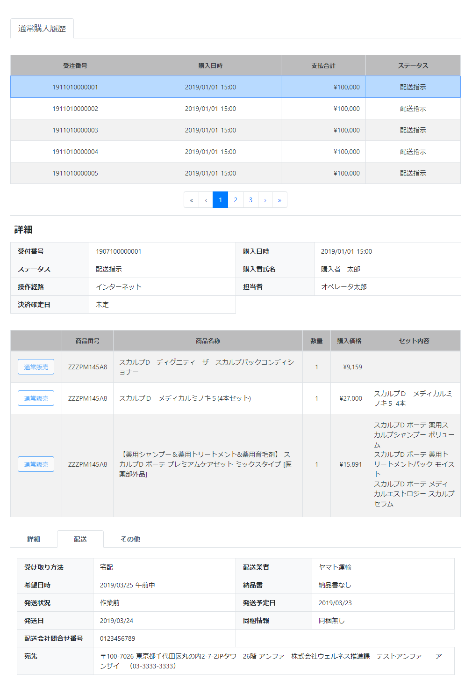

# 通常購入履歴: 配送
||
|:-:|

## Action

| Action No. | Action名 | 概要 | 画面 | 遷移先 | 中継API | 
| --- | --- | --- | --- | --- | --- |
| A | 注文配送データ取得 | 受注した注文・配送情報を取得・検索する | 1 | own | [query.Query/post_query_order__search](http://3.114.104.100/#/query.Query/post_query_order__search) |

## 中継API
### A: 注文配送データ取得

| API名 | リンク |
| --- | --- |
| 注文データ取得API | [query.Query/post_query_order__search](http://3.114.104.100/#/query.Query/post_query_order__search) |

#### Request

| 必須 | 物理名 | 型（桁） | 論理名(David) | 論理名（Prismatix） |
| --- | --- | --- | --- | --- |
|  | customer_code | string | 会員コード | 同左 |

#### Response

| 必須 | 物理名 | 型（桁） | 論理名(David) | 論理名（Prismatix） |
| --- | --- | --- | --- | --- |
|  | hits[total] (Excelなし) |  |  |  |
|  | hits[hits][_source][order_code] (Excelなし) |  |  |  |
|  | hits[hits][_source][checkout_timestamp] (Excelなし) |  |  |  |
|  | hits[hits][_source][paid_timestamp] (Excelなし) |  |  |  |
|  | hits[hits][_source][currency_code] | string | 通貨コード (ISO 4217 に準拠) | 同左 |
|  | hits[hits][_source][total_ex_vat] (Excelなし) |  |  |  |
|  | hits[hits][_source][total_in_vat] (Excelなし) |  |  |  |
|  | hits[hits][_source][delivery_status] (Excelなし) |  |  |  |
|  | hits[hits][_source][order_details][order_detail_id] (Excelなし) |  |  |  |
|  | hits[hits][_source][order_details][order_detail_code] (Excelなし) |  |  |  |
|  | hits[hits][_source][order_details][order_code] (Excelなし) |  |  |  |
|  | hits[hits][_source][customer][customer_code] | string | 会員コード | 同左 |
|  | hits[hits][_source][customer][name] | JSON | 配送先氏名 (JSON format) | 同左 |
|  | hits[hits][_source][user_order_type] (Excelなし) |  |  |  |
|  | hits[hits][_source][order_details][register_principal] | string | 作成者のユーザ名 | 同左 |
|  | hits[hits][_source][order_details][update_principal] | string | 更新者のユーザ名 | 同左 |
|  | hits[hits][_source][order_details][sku_code] | string | SKUコード | 同左 |
|  | hits[hits][_source][order_details][sku_name] | string | 社内登録名称（愛称） | SKU名 |
|  | hits[hits][_source][order_details][quantity] (Excelなし) |  |  |  |
|  | hits[hits][_source][order_details][price_ex_vat] | decimal | 税抜売価 | 同左 |
|  | hits[hits][_source][order_details][price_in_vat] | decimal | 税込売価 | 同左 |
|  | hits[hits][_source][order_details][sku_details] (Excelなし) |  |  |  |
|  | hits[hits][_source][receipt_type] (Excelなし) |  |  |  |
|  | hits[hits][_source][delivery_details][delivery_company_code] (Excelなし) |  |  |  |
|  | hits[hits][_source][delivery_details][delivery_wish_timestamp] (Excelなし) |  |  |  |
|  | hits[hits][_source][delivery_status] (Excelなし) |  |  |  |
|  | hits[hits][_source][delivery_details][delivery_plan_timestamp] (Excelなし) |  |  |  |
|  | hits[hits][_source][delivery_details][delivery_plan_term] (Excelなし) |  |  |  |
|  | hits[hits][_source][shipped_timestamp] (Excelなし) |  |  |  |
|  | hits[hits][_source][delivery_address][delivery_info_code] | string | 配送先情報コード | 同左 |
|  | hits[hits][_source][delivery_address][delivery_info_nickname] | string | 配送先名 | 配送先情報ニックネーム |
|  | hits[hits][_source][delivery_address][zip_code] | string | 郵便番号（ハイフンあり） | 郵便番号 |
|  | hits[hits][_source][delivery_address][country] | string | 国 | 同左 |
|  | hits[hits][_source][delivery_address][state] | string | 都道府県/州 | 同左 |
|  | hits[hits][_source][delivery_address][city] | string | 市町村 | 同左 |
|  | hits[hits][_source][delivery_address][address1] | string | 住所 1 (地域/字) | 同左 |
|  | hits[hits][_source][delivery_address][address2] | string | 住所 2 (番地/建物名) | 同左 |
|  | hits[hits][_source][delivery_address][tel] | string | 電話番号(ハイフン無し) | 電話番号 |

## 質問事項
| Action NO.| Request or Response | 質問内容 |
| ---| --- | --- |
| A | Response | hits[hits][_source][currency_code] はどのExcelファイルを参照すれば良いのか(表には価格リソース20191126-01のものを記入したが恐らく参照するExcelファイルが違い、尚且つ参照するべきExcelファイルが存在しない)
| A | Response | hits[hits][_source][customer][customer_code] はどのExcelファイルを参照すれば良いのか(表には会員リソース20191127-01のものを記入したが恐らく参照するExcelファイルが違い、尚且つ参照するべきExcelファイルが存在しない)
| A | Response | hits[hits][_source][customer][name] はどのExcelファイルを参照すれば良いのか(表には配送先リソース20191101-01のものを記入したが恐らく参照するExcelファイルが違い、尚且つ参照するべきExcelファイルが存在しない)
| A | Response | hits[hits][_source][order_details][register_principal] はどのExcelファイルを参照すれば良いのか(表には配送先リソース20191101-01のものを記入したが恐らく参照するExcelファイルが違い、尚且つ参照するべきExcelファイルが存在しない)
| A | Response | hits[hits][_source][order_details][update_principal] はどのExcelファイルを参照すれば良いのか(表には配送先リソース20191101-01のものを記入したが恐らく参照するExcelファイルが違い、尚且つ参照するべきExcelファイルが存在しない)
| A | Response | hits[hits][_source][order_details][sku_code] はどのExcelファイルを参照すれば良いのか(表には単品リソース20191202-01のものを記入したが恐らく参照するExcelファイルが違い、尚且つ参照するべきExcelファイルが存在しない)|
| A | Response | hits[hits][_source][order_details][sku_name] はどのExcelファイルを参照すれば良いのか(表には単品リソース20191202-01のものを記入したが恐らく参照するExcelファイルが違い、尚且つ参照するべきExcelファイルが存在しない)|
| A | Response | hits[hits][_source][order_details][price_ex_vat] はどのExcelファイルを参照すれば良いのか(表には価格リソース20191126-01のものを記入したが恐らく参照するExcelファイルが違い、尚且つ参照するべきExcelファイルが存在しない)|
| A | Response | hits[hits][_source][order_details][price_in_vat] はどのExcelファイルを参照すれば良いのか(表には価格リソース20191126-01のものを記入したが恐らく参照するExcelファイルが違い、尚且つ参照するべきExcelファイルが存在しない)|
| A | Response | hits[hits][_source][delivery_address][delivery_info_code] はどのExcelファイルを参照すれば良いのか(表には配送先リソース20191101-01のものを記入したが恐らく参照するExcelファイルが違い、尚且つ参照するべきExcelファイルが存在しない)|
| A | Response | hits[hits][_source][delivery_address][delivery_info_nickname] はどのExcelファイルを参照すれば良いのか(表には配送先リソース20191101-01のものを記入したが恐らく参照するExcelファイルが違い、尚且つ参照するべきExcelファイルが存在しない)|
| A | Response | hits[hits][_source][delivery_address][zip_code] はどのExcelファイルを参照すれば良いのか(表には配送先リソース_20191101-01のものを記入したが恐らく参照するExcelファイルが違い、尚且つ参照するべきExcelファイルが存在しない)|
| A | Response | hits[hits][_source][delivery_address][country] はどのExcelファイルを参照すれば良いのか(表には配送先リソース_20191101-01のものを記入したが恐らく参照するExcelファイルが違い、尚且つ参照するべきExcelファイルが存在しない)|
| A | Response | hits[hits][_source][delivery_address][state] はどのExcelファイルを参照すれば良いのか(表には配送先リソース_20191101-01のものを記入したが恐らく参照するExcelファイルが違い、尚且つ参照するべきExcelファイルが存在しない)|
| A | Response | hits[hits][_source][delivery_address][city] はどのExcelファイルを参照すれば良いのか(表には配送先リソース_20191101-01のものを記入したが恐らく参照するExcelファイルが違い、尚且つ参照するべきExcelファイルが存在しない) |
| A | Response | hits[hits][_source][delivery_address][address1] はどのExcelファイルを参照すれば良いのか(表には配送先リソース_20191101-01のものを記入したが恐らく参照するExcelファイルが違い、尚且つ参照するべきExcelファイルが存在しない) |
| A | Response | hits[hits][_source][delivery_address][address2] はどのExcelファイルを参照すれば良いのか(表には配送先リソース_20191101-01のものを記入したが恐らく参照するExcelファイルが違い、尚且つ参照するべきExcelファイルが存在しない) |
| A | Response | hits[hits][_source][delivery_address][tel] はどのExcelファイルを参照すれば良いのか(表には配送先リソース_20191101-01のものを記入したが恐らく参照するExcelファイルが違い、尚且つ参照するべきExcelファイルが存在しない) |

## 確認事項
* 購入日時は hits[hits][_source][checkout_timestamp] で合っているのか
* 決済確定日は hits[hits][_source][paid_timestamp] で合っているのか
* 納品書あるなしはどのAPIから取得するのか
* 同梱情報はどのAPIから取得するのか
* 配送会社問合せ番号はどのAPIから取得するのか