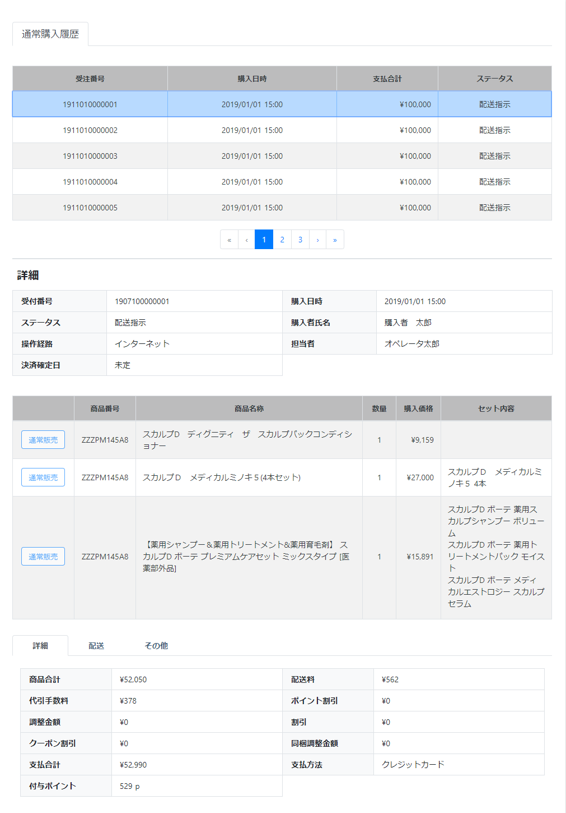

# 通常購入履歴: 詳細
||
|:-:|

## Action

| Action No. | Action名 | 概要 | 画面 | 遷移先 | 中継API | 
| --- | --- | --- | --- | --- | --- |
| A | 注文詳細データ取得 | 受注した注文・詳細情報を取得・検索する | 1 | own | [query.Query/queryOrder_searchPOST](http://3.114.104.100/#/query.Query/queryOrder_searchPOST) |

## 中継API
### A: 注文詳細データ取得

| API名 | リンク |
| --- | --- |
| 注文データ取得API | [query.Query/queryOrder_searchPOST](http://3.114.104.100/#/query.Query/queryOrder_searchPOST) |

#### Request

| 必須 | 物理名 | 型（桁） | 論理名(David) | 論理名（Prismatix） |
| --- | --- | --- | --- | --- |
|  | customer_code | string | 会員コード | 同左 |
|  | size | string | サイズ | 同左 |
|  | from(Excelなし) |  |  |  |

#### Response

| 必須 | 物理名 | 型（桁） | 論理名(David) | 論理名（Prismatix） |
| --- | --- | --- | --- | --- |
|  | hits[hits][_source][order_details][order_detail_id] (Excelなし) |  |  |  |
|  | hits[hits][_source][order_details][order_detail_code] (Excelなし) |  |  |  |
|  | hits[hits][_source][order_details][order_code] (Excelなし) |  |  |  |
|  | hits[hits][_source][customer][customer_code] | string | 会員コード | 同左 |
|  | hits[hits][_source][customer][name] | JSON | 配送先氏名 (JSON format) | 同左 |
|  | hits[hits][_source][order_details][register_principal] | string | 作成者のユーザ名 | 同左 |
|  | hits[hits][_source][order_details][update_principal] | string | 更新者のユーザ名 | 同左 |
|  | hits[hits][_source][order_details][sku_code] | string | SKUコード | 同左 |
|  | hits[hits][_source][order_details][sku_name] | string | 社内登録名称（愛称） | SKU名 |
|  | hits[hits][_source][order_details][quantity] (Excelなし) |  |  |  |
|  | hits[hits][_source][order_details][price_ex_vat] | decimal | 税抜売価 | 同左 |
|  | hits[hits][_source][order_details][price_in_vat] | decimal | 税込売価 | 同左 |
|  | hits[hits][_source][order_details][sku_details] (Excelなし) |  |  |  |
|  | hits[hits][_source][delivery_fee_ex_vat] (Excelなし) |  |  |  |
|  | hits[hits][_source][delivery_fee_in_vat] (Excelなし) |  |  |  |
|  | hits[hits][_source][adjustment_ex_vat] (Excelなし) |  |  |  |
|  | hits[hits][_source][adjustment_in_vat] (Excelなし) |  |  |  |
|  | hits[hits][_source][order_addon_services][addon_service_code] | string | 付帯作業価格コード | 同左 |
|  | hits[hits][_source][order_addon_services][amount_ex_vat] (Excelなし) |  |  |  |
|  | hits[hits][_source][order_addon_services][amount_in_vat] (Excelなし) |  |  |  |
|  | hits[hits][_source][discount_ex_vat] (Excelなし) |  |  |  |
|  | hits[hits][_source][discount_in_vat] (Excelなし) |  |  |  |
|  | hits[hits][_source][payment_method] (Excelなし) |  |  |  |
|  | hits[hits][_source][user_order_status] (Excelなし) |  |  |  |
|  | hits[hits][_source][user_order_type] (Excelなし) |  |  |  |
|  | hits[hits][_source][discount_details][issued_coupon_code] (Excelなし) |  |  |  |
|  | hits[hits][_source][discount_details][discount_type] (Excelなし) |  |  |  |
|  | hits[hits][_source][discount_details][percent_off_discount_rate] (Excelなし) |  |  |  |
|  | hits[hits][_source][discount_details][amount_off_discount_ex_vat] (Excelなし) |  |  |  |
|  | hits[hits][_source][discount_details][currency_code] | string | 通貨コード (ISO 4217 に準拠) | 同左 |

## 質問事項
| Action NO.| Request or Response | 質問内容 |
| ---| --- | --- |
| A | Response | hits[hits][_source][currency_code] はどのExcelファイルを参照すれば良いのか(表には価格リソース20191126-01のものを記入したが恐らく参照するExcelファイルが違い、尚且つ参照するべきExcelファイルが存在しない)
| A | Response | hits[hits][_source][customer][customer_code] はどのExcelファイルを参照すれば良いのか(表には会員リソース20191127-01のものを記入したが恐らく参照するExcelファイルが違い、尚且つ参照するべきExcelファイルが存在しない)
| A | Response | hits[hits][_source][customer][name] はどのExcelファイルを参照すれば良いのか(表には配送先リソース20191101-01のものを記入したが恐らく参照するExcelファイルが違い、尚且つ参照するべきExcelファイルが存在しない)
| A | Response | hits[hits][_source][order_details][register_principal] はどのExcelファイルを参照すれば良いのか(表には配送先リソース20191101-01のものを記入したが恐らく参照するExcelファイルが違い、尚且つ参照するべきExcelファイルが存在しない)
| A | Response | hits[hits][_source][order_details][update_principal] はどのExcelファイルを参照すれば良いのか(表には配送先リソース20191101-01のものを記入したが恐らく参照するExcelファイルが違い、尚且つ参照するべきExcelファイルが存在しない)
| A | Response | hits[hits][_source][order_details][sku_code] はどのExcelファイルを参照すれば良いのか(表には単品リソース20191202-01のものを記入したが恐らく参照するExcelファイルが違い、尚且つ参照するべきExcelファイルが存在しない)|
| A | Response | hits[hits][_source][order_details][sku_name] はどのExcelファイルを参照すれば良いのか(表には単品リソース20191202-01のものを記入したが恐らく参照するExcelファイルが違い、尚且つ参照するべきExcelファイルが存在しない)|
| A | Response | hits[hits][_source][order_details][price_ex_vat] はどのExcelファイルを参照すれば良いのか(表には価格リソース20191126-01のものを記入したが恐らく参照するExcelファイルが違い、尚且つ参照するべきExcelファイルが存在しない)|
| A | Response | hits[hits][_source][order_details][price_in_vat] はどのExcelファイルを参照すれば良いのか(表には価格リソース20191126-01のものを記入したが恐らく参照するExcelファイルが違い、尚且つ参照するべきExcelファイルが存在しない)|
| A | Response | hits[hits][_source][discount_details][currency_code] はどのExcelファイルを参照すれば良いのか(表には価格リソース20191126-01のものを記入したが恐らく参照するExcelファイルが違い、尚且つ参照するべきExcelファイルが存在しない)|
| A | Response | order_addon_services[addon_service_code] はどのExcelファイルを参照すれば良いのか(表には付帯作業価格リソース20191101-01のものを記入したが恐らく参照するExcelファイルが違い、尚且つ参照するべきExcelファイルが存在しない)|

## 確認事項
* 購入日時は hits[hits][_source][checkout_timestamp] で合っているのか
* 決済確定日は hits[hits][_source][paid_timestamp] で合っているのか
* ポイント割引はどのAPIで取得するのか
* 同梱調整金額はどのAPIで取得するのか
* 付与ポイントはどのAPIで取得するのか