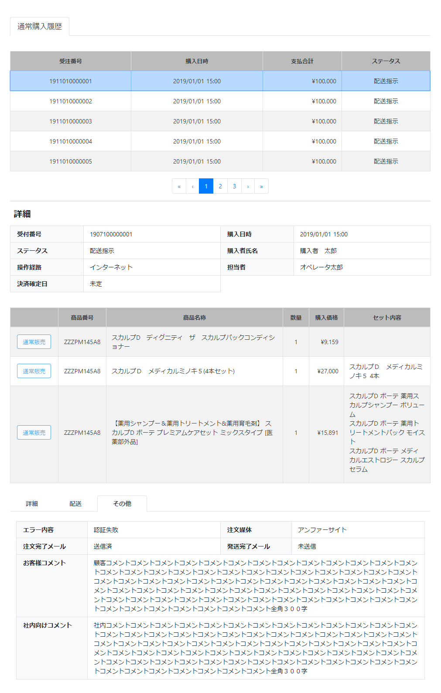

# 通常購入履歴: その他
||
|:-:|

## Action

| Action No. | Action名 | 概要 | 画面 | 遷移先 | 中継API | 
| --- | --- | --- | --- | --- | --- |
| A | 注文データ取得(その他) | 受注した注文・情報(その他)を取得・検索する | 1 | own | [query.Query/post_query_order__search](http://3.114.104.100/#/query.Query/post_query_order__search) |
| B | メール状態取得 | 注文完了、発送完了メールの状態を取得する | 1 | own | [notification.MailActivity/get_mail_activities__mail_activity_code___mail_address__mail_address_](http://3.114.104.100/#/notification.MailActivity/get_mail_activities__mail_activity_code___mail_address__mail_address_) |

## 中継API
### A: 注文データ取得(その他)

| API名 | リンク |
| --- | --- |
| 注文データ取得API | [query.Query/post_query_order__search](http://3.114.104.100/#/query.Query/post_query_order__search) |

#### Request

| 必須 | 物理名 | 型（桁） | 論理名(David) | 論理名（Prismatix） |
| --- | --- | --- | --- | --- |
|  | customer_code | string | 会員コード | 同左 |

#### Response

| 必須 | 物理名 | 型（桁） | 論理名(David) | 論理名（Prismatix） |
| --- | --- | --- | --- | --- |
|  | hits[hits][_source][order_details][order_detail_id] (Excelなし) |  |  |  |
|  | hits[hits][_source][order_details][order_detail_code] (Excelなし) |  |  |  |
|  | hits[hits][_source][order_details][order_code] (Excelなし) |  |  |  |
|  | hits[hits][_source][customer][customer_code] | string | 会員コード | 同左 |
|  | hits[hits][_source][customer][name] | JSON | 配送先氏名 (JSON format) | 同左 |
|  | hits[hits][_source][user_order_type] (Excelなし) |  |  |  |
|  | hits[hits][_source][order_details][register_principal] | string | 作成者のユーザ名 | 同左 |
|  | hits[hits][_source][order_details][update_principal] | string | 更新者のユーザ名 | 同左 |
|  | hits[hits][_source][order_details][sku_code] | string | SKUコード | 同左 |
|  | hits[hits][_source][order_details][sku_name] | string | 社内登録名称（愛称） | SKU名 |
|  | hits[hits][_source][order_details][quantity] (Excelなし) |  |  |  |
|  | hits[hits][_source][order_details][price_ex_vat] | decimal | 税抜売価 | 同左 |
|  | hits[hits][_source][order_details][price_in_vat] | decimal | 税込売価 | 同左 |
|  | hits[hits][_source][order_details][sku_details] (Excelなし) |  |  |  |
|  | hits[hits][_source][store_code] string | 対応店舗 | 同左 |

### B: メール状態取得

| API名 | リンク |
| --- | --- |
| メール状態取得API | [notification.MailActivity/get_mail_activities__mail_activity_code___mail_address__mail_address_](http://3.114.104.100/#/notification.MailActivity/get_mail_activities__mail_activity_code___mail_address__mail_address_) |

#### Request

| 必須 | 物理名 | 型（桁） | 論理名(David) | 論理名（Prismatix） |
| --- | --- | --- | --- | --- |
| 〇 | mail_activity_code(Excelなし) |  |  |  |
| 〇 | mail_address(Excelなし) |  |  |  |
| 〇 | type(Excelなし) |  |  |  |

#### Response

| 必須 | 物理名 | 型（桁） | 論理名(David) | 論理名（Prismatix） |
| --- | --- | --- | --- | --- |
|  | _embedded[mail_activities][status] (Excelなし) |  |  |  |

## 質問事項
| Action NO.| Request or Response | 質問内容 |
| ---| --- | --- |
| A | Response | hits[hits][_source][currency_code] はどのExcelファイルを参照すれば良いのか(表には価格リソース20191126-01のものを記入したが恐らく参照するExcelファイルが違い、尚且つ参照するべきExcelファイルが存在しない)
| A | Response | hits[hits][_source][customer][customer_code] はどのExcelファイルを参照すれば良いのか(表には会員リソース20191127-01のものを記入したが恐らく参照するExcelファイルが違い、尚且つ参照するべきExcelファイルが存在しない)
| A | Response | hits[hits][_source][customer][name] はどのExcelファイルを参照すれば良いのか(表には配送先リソース20191101-01のものを記入したが恐らく参照するExcelファイルが違い、尚且つ参照するべきExcelファイルが存在しない)
| A | Response | hits[hits][_source][order_details][register_principal] はどのExcelファイルを参照すれば良いのか(表には配送先リソース20191101-01のものを記入したが恐らく参照するExcelファイルが違い、尚且つ参照するべきExcelファイルが存在しない)
| A | Response | hits[hits][_source][order_details][update_principal] はどのExcelファイルを参照すれば良いのか(表には配送先リソース20191101-01のものを記入したが恐らく参照するExcelファイルが違い、尚且つ参照するべきExcelファイルが存在しない)
| A | Response | hits[hits][_source][order_details][sku_code] はどのExcelファイルを参照すれば良いのか(表には単品リソース20191202-01のものを記入したが恐らく参照するExcelファイルが違い、尚且つ参照するべきExcelファイルが存在しない)|
| A | Response | hits[hits][_source][order_details][sku_name] はどのExcelファイルを参照すれば良いのか(表には単品リソース20191202-01のものを記入したが恐らく参照するExcelファイルが違い、尚且つ参照するべきExcelファイルが存在しない)|
| A | Response | hits[hits][_source][order_details][price_ex_vat] はどのExcelファイルを参照すれば良いのか(表には価格リソース20191126-01のものを記入したが恐らく参照するExcelファイルが違い、尚且つ参照するべきExcelファイルが存在しない)|
| A | Response | hits[hits][_source][order_details][price_in_vat] はどのExcelファイルを参照すれば良いのか(表には価格リソース20191126-01のものを記入したが恐らく参照するExcelファイルが違い、尚且つ参照するべきExcelファイルが存在しない)|
| A | Response | hits[hits][_source][store_code] はどのExcelファイルを参照すれば良いのか(表には単品リソース20191202-01のものを記入したが恐らく参照するExcelファイルが違い、尚且つ参照するべきExcelファイルが存在しない)|

## 確認事項
* 購入日時は hits[hits][_source][checkout_timestamp] で合っているのか
* 決済確定日は hits[hits][_source][paid_timestamp] で合っているのか
* エラー内容はどのAPIから取得するのか
* お客様コメント、社内向けコメントを取得するAPIは無いのか