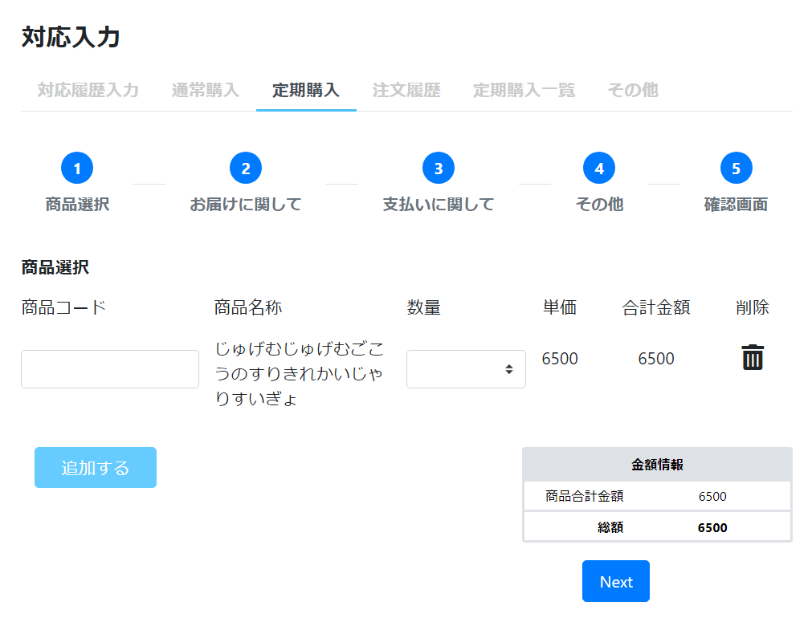

# 定期購入: Step1 商品
||  
|:-:|

## Action

| Action No. | Action名 | 概要 | 画面 | 遷移先 | 中継API | 
| --- | --- | --- | --- | --- | --- |
| A | 商品情報取得 | 商品コードから商品名と単価を取得する | 1 | own | [item.Sku/get_skus__sku_code_](http://3.114.104.100/#/item.Sku/get_skus__sku_code_) |
| B | 定期購入商品(sku)登録 | 指定した商品を定期購入商品として登録(変更)する | 2 | own | [order.PeriodicalPurchase/put_periodical_purchases__periodical_purchase_code__sku](http://3.114.104.100/#/order.PeriodicalPurchase/put_periodical_purchases__periodical_purchase_code__sku) |
| C | 定期購入カート作成 | Cの商品1つに対して定期購入カートを作成する | 1 | own |  |
| D | 配送料・カート金額・還元ポイントを取得 | カートに関する情報を取得 | 2 | own | [order.Cart/post_carts__cart_code___calculate](http://3.114.104.100/#/order.Cart/post_carts__cart_code___calculate) |
| E | ページ遷移（Step2） | ページ遷移（Step2） | 3 | 通常購入: Step2 配送 | なし |

## 中継API
### A: 商品情報取得

| API名 | リンク |
| --- | --- |
| 注文データ取得API | [item.Sku/get_skus__sku_code_](http://3.114.104.100/#/item.Sku/get_skus__sku_code_) |  

#### Request

| 必須 | 物理名 | 型（桁） | 論理名(David) | 論理名（Prismatix） |
| --- | --- | --- | --- | --- |
| 〇 | sku_code | string | SKUコード | 同左 |

#### Response

| 必須 | 物理名 | 型（桁） | 論理名(David) | 論理名（Prismatix） |
| --- | --- | --- | --- | --- |
| 〇 | sku_name | string | 社内登録名称（愛称） | SKU名 |
|  | base_price_ex_vat(Excelの方がbase_price_ex_batとなってました。) | number | 基本価格(税抜) | 同左 |
|  | base_price_in_vat(Excelの方がbase_price_in_batとなってました。) | number | 基本価格(税込) | 同左 |

### B: 定期購入商品(sku)登録

| API名 | リンク |
| --- | --- |
| 定期購入商品登録API | [order.PeriodicalPurchase/put_periodical_purchases__periodical_purchase_code__sku](http://3.114.104.100/#/order.PeriodicalPurchase/put_periodical_purchases__periodical_purchase_code__sku) |  

#### Request

| 必須 | 物理名 | 型（桁） | 論理名(David) | 論理名（Prismatix） |
| ---| --- | --- | --- | --- |
| 〇 | sku_code | string | SKUコード | 同左 |
| 〇 | quantity |  |  |  |
| 〇 | store_code | string | 対応店舗 | 同左 |
|  | sku_name | string | 社内登録名称（愛称） | SKU名 |

#### Response

| 必須 | 物理名 | 型（桁） | 論理名(David) | 論理名（Prismatix） |
| --- | --- | --- | --- | --- |
|  | (status_code) |  |  |  |
|  | periodical_purchase_code(Excelなし) |  |  |  |
|  | periodical_purchases[sku][sku_code] | string | SKUコード | 同左 |
|  | periodical_purchases[sku][sku_name] | string | 社内登録名称（愛称） | SKU名 |
|  | periodical_purchases[sku][quantity] (Excelなし) |  |  |  |
|  | periodical_purchases[sku][price_ex_vat] | decimal | 税抜売価 | 同左 |
|  | periodical_purchases[sku][price_in_vat] | decimal | 税込売価 | 同左 |

### C: 定期購入カート作成

| API名 | リンク |
| --- | --- |
| 定期購入カート作成API |  |

#### Request

| 必須 | 物理名 | 型（桁） | 論理名(David) | 論理名（Prismatix） |
| --- | --- | --- | --- | --- |
|  |  |  |  |  |

#### Response

| 物理名 | 型（桁） | 論理名(David) | 論理名（Prismatix） |
| --- | --- | --- | --- |
|  |  |  |  |  |

### D: 配送料・カート金額・還元ポイントを取得

| API名 | リンク |
| --- | --- |
| カート情報取得API | [order.Cart/post_carts__cart_code___calculate](http://3.114.104.100/#/order.Cart/post_carts__cart_code___calculate) |  

#### Request

| 必須 | 物理名 | 型（桁） | 論理名(David) | 論理名（Prismatix） |
| --- | --- | --- | --- | --- |
|  | apply_discount_flag(Excelなし) |  |  |  |
|  | amount_fields_for_coupon_applicable_condition(Excelなし) |  |  |  |

#### Response

| 必須 | 物理名 | 型（桁） | 論理名(David) | 論理名（Prismatix） |
| --- | --- | --- | --- | --- |
| 〇 | order_vat_details[tax_code] | string | 税コード | 同左 |
| 〇 | order_vat_details[tax_name] | string | 税名 | 同左 |
| 〇 | order_vat_details[tax_rate] | number | 税率 | 税率 (0.0<=、1.0で100%) |
| 〇 | order_vat_details[sku_in_vat] (Excelなし) |  |  |  |
| 〇 | order_vat_details[addon_service_in_vat] (Excelなし) |  |  |  |
| 〇 | order_vat_details[discount_in_vat] (Excelなし) |  |  |  |
| 〇 | order_vat_details[point_in_vat] (Excelなし) |  |  |  |
| 〇 | order_vat_details[adjustment_in_vat] (Excelなし) |  |  |  |
| 〇 | order_vat_details[delivery_fee_in_vat] (Excelなし) |  |  |  |
| 〇 | order_vat_details[subtotal_ex_vat] (Excelなし) |  |  |  |
| 〇 | order_vat_details[subtotal_in_vat] (Excelなし) |  |  |  |
|  | cart_code(Excelなし) |  |  |  |
|  | point Variation Value(Excelなし) |  |  |  |

## 質問事項
| Action NO.| Request or Response | 質問内容 |
| ---| --- | --- |
| B | Request | store_code はどのExcelファイルを参照すれば良いのか(表には単品リソース20191202-01のものを記入)|
| B | Response | periodical_purchases[sku][sku_code] はどのExcelファイルを参照すれば良いのか(表には単品リソース20191202-01のものを記入したが恐らく参照するExcelファイルが違い、尚且つ参照するべきExcelファイルが存在しない)|
| B | Response | periodical_purchases[sku][sku_name] はどのExcelファイルを参照すれば良いのか(表には単品リソース20191202-01のものを記入したが恐らく参照するExcelファイルが違い、尚且つ参照するべきExcelファイルが存在しない)|
| B Response | periodical_purchases[sku][price_ex_vat] はどのExcelファイルを参照すれば良いのか(表には価格リソース20191126-01のものを記入したが恐らく参照するExcelファイルが違い、尚且つ参照するべきExcelファイルが存在しない)|
| B | Response | periodical_purchases[sku][price_in_vat] はどのExcelファイルを参照すれば良いのか(表には価格リソース20191126-01のものを記入したが恐らく参照するExcelファイルが違い、尚且つ参照するべきExcelファイルが存在しない)|

## 確認事項
* 定期購入商品(sku)登録(B)は上記のAPIで間違いないか？
* Prismatixの構造上、中継APIに商品を定期購入登録した後に1つ1つの商品に対して定期購入カートが生成されるAPI(C)があるはずだが、まだ作られてない？