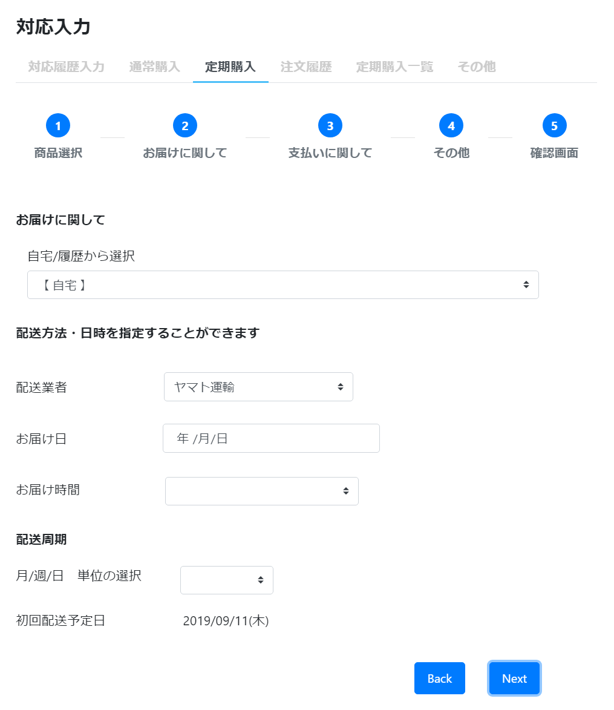

# 定期購入: Step2 配送
||  
|:-:|

## Action

| Action No. | Action名 | 概要 | 画面 | 遷移先 | 中継API | 
| --- | --- | --- | --- | --- | --- |
| A | 顧客配送情報取得 | 顧客の配送先一覧を取得する | | own | [customer.Customer/get_customers__customer_code_](http://3.114.104.100/#/customer.Customer/get_customers__customer_code_) |
| B | 顧客配送先設定（登録） | 顧客の配送先を登録する | | own | [customer.DeliveryInfo/post_customers__customer_code__delivery_info](http://3.114.104.100/#/customer.DeliveryInfo/post_customers__customer_code__delivery_info) |
| C | カート配送先設定（カートに配送先を設定） | カートに配送先を設定する | | own | [order.Cart/post_carts__cart_code___update__address](http://3.114.104.100/#/order.Cart/post_carts__cart_code___update__address)|
| D | カート配送先設定（登録住所/配送先住所をチェック） | 登録住所と配送先住所が同じかチェックする | | own | [order.Cart/post_carts__cart_code___check_address](http://3.114.104.100/#/order.Cart/post_carts__cart_code___check_address) |
| E | 配送方法設定（カートに配送方法を設定） | カートに配送方法を設定する | | own | [order.Cart/post_carts__cart_code___update__delivery](http://3.114.104.100/#/order.Cart/post_carts__cart_code___update__delivery) |
| F | 配送方法設定（適応可能な配送方法をチェック） | 商品に対して適応可能な配送方法を取得する | | own | [order.Cart/post_carts__cart_code___delivery_check](http://3.114.104.100/#/order.Cart/post_carts__cart_code___delivery_check) |
| G | リードタイム結果取得 | 該当するリードタイムを取得する | | own | [order.Order/getOrderLeadTime](http://3.114.104.100/#/order.Order/getOrderLeadTime) |
| H | 配送周期設定 | 配送周期を設定する | | own | [order.PeriodicalPurchase/post_periodical_purchases__periodical_purchase_code___update_schedule](http://3.114.104.100/#/order.PeriodicalPurchase/post_periodical_purchases__periodical_purchase_code___update_schedule) |

## 中継API
### A: 顧客配送情報取得

| API名 | リンク |
| --- | --- |
| 顧客配送情報取得API | [customer.Customer/get_customers__customer_code_](http://3.114.104.100/#/customer.Customer/get_customers__customer_code_) |

#### Request

| 必須 | 物理名 | 型（桁） | 論理名(David) | 論理名（Prismatix） |
| --- | --- | --- | --- | --- |
| 〇 | customer_code | string | 会員コード | 同左 |

#### Response

| 必須 | 物理名 | 型（桁） | 論理名(David) | 論理名（Prismatix） |
| --- | --- | --- | --- | --- |
|  | deliveryInfoList[customer_code] | string | 会員コード | 同左 |
|  | deliveryInfoList[delivery_info_code] | string | 配送先情報コード | 同左 |
|  | deliveryInfoList[delivery_info_nickname] | string | 配送先名 | 配送先情報ニックネーム |
|  | deliveryInfoList[lang] | string | 使用言語 | 同左 |
|  | deliveryInfoList[zip_code] | string | 郵便番号（ハイフンあり） | 郵便番号 |
|  | deliveryInfoList[country] | string | 国 | 同左 |
|  | deliveryInfoList[state] | string | 都道府県/州 | 同左 |
|  | deliveryInfoList[city] | string | 市町村 | 同左 |
|  | deliveryInfoList[address1] | string | 住所 1 (地域/字) | 同左 |
|  | deliveryInfoList[address2] | string | 住所 2 (番地/建物名) | 同左 |
|  | deliveryInfoList[name][last_name_kanji] | string | 配送先-姓 (漢字) | 姓 (漢字) |
|  | deliveryInfoList[name][first_name_kanji] | string | 配送先-名 (漢字) | 名 (漢字) |
|  | deliveryInfoList[name][last_name_kana] | string | 配送先-姓 (カナ) | 姓 (カナ) |
|  | deliveryInfoList[name][first_name_kana] | string | 配送先-名 (カナ) | 名 (カナ) |
|  | deliveryInfoList[tel] | string | 電話番号(ハイフン無し) | 電話番号 |

### B: 顧客配送先設定（登録）

| API名 | リンク |
| --- | --- |
| 顧客配送先登録API | [customer.DeliveryInfo/post_customers__customer_code__delivery_info](http://3.114.104.100/#/customer.DeliveryInfo/post_customers__customer_code__delivery_info) |

#### Request

| 必須 | 物理名 | 型（桁） | 論理名(David) | 論理名（Prismatix） |
| --- | --- | --- | --- | --- |
| 〇 | customer_code | string | 会員コード | 同左 |
| 〇 | delivery_info_code | string | 配送先情報コード | 同左 |
| 〇 | delivery_info_nickname | string | 配送先名 | 配送先情報ニックネーム |
| 〇 | lang | string | 使用言語 | 同左 |
| 〇 | zip_code | string | 郵便番号（ハイフンあり） | 郵便番号 |
| 〇 | country | string | 国 | 同左 |
| 〇 | state | string | 都道府県/州 | 同左 |
| 〇 | city | string | 市町村 | 同左 |
| 〇 | address1 | string | 住所 1 (地域/字) | 同左 |
|  | address2 | string | 住所 2 (番地/建物名) | 同左 |
| 〇 | name[last_name_kanji] | string | 配送先-姓 (漢字) | 姓 (漢字) |
| 〇 | name[first_name_kanji] | string | 配送先-名 (漢字) | 名 (漢字) |
| 〇 | name[last_name_kana] | string | 配送先-姓 (カナ) | 姓 (カナ) |
| 〇 | name[first_name_kana] | string | 配送先-名 (カナ) | 名 (カナ) |
|  | tel | string | 電話番号(ハイフン無し) | 電話番号 |

#### Response

| 必須 | 物理名 | 型（桁） | 論理名(David) | 論理名（Prismatix） |
| --- | --- | --- | --- | --- |
|  | (status_code) |  |  |  |

### C: カート配送先設定（カートに配送先を設定）

| API名 | リンク |
| --- | --- |
| カート配送先設定API | [order.Cart/post_carts__cart_code___update__address](http://3.114.104.100/#/order.Cart/post_carts__cart_code___update__address) |

#### Request

| 必須 | 物理名 | 型（桁） | 論理名(David) | 論理名（Prismatix） |
| --- | --- | --- | --- | --- |
| 〇 | cart_code(Excelなし) |  |  |  |
|  | delivery_address[delivery_info_code] | string | 配送先情報コード | 同左 |
|  | delivery_address[lang] | string | 使用言語 | 同左 |
|  | delivery_address[delivery_info_nickname] | string | 配送先名 | 配送先情報ニックネーム |
|  | delivery_address[zip_code] | string | 郵便番号（ハイフンあり） | 郵便番号 |
|  | delivery_address[country] | string | 国 | 同左 |
|  | delivery_address[state] | string | 都道府県/州 | 同左 |
|  | delivery_address[city] | string | 市町村 | 同左 |
|  | delivery_address[address1] | string | 住所 1 (地域/字) | 同左 |
|  | delivery_address[address2] | string | 住所 2 (番地/建物名) | 同左 |
|  | delivery_address[name] | JSON | 配送先氏名 (JSON format) | 同左 |
|  | delivery_address[tel] | string | 電話番号(ハイフン無し) | 電話番号 |

#### Response

| 必須 | 物理名 | 型（桁） | 論理名(David) | 論理名（Prismatix） |
| --- | --- | --- | --- | --- |
|  | (status_code) |  |  |  |

### D: カート配送先設定（登録住所/配送先住所をチェック）

| API名 | リンク |
| --- | --- |
| カート配送先確認API | [order.Cart/post_carts__cart_code___check_address](http://3.114.104.100/#/order.Cart/post_carts__cart_code___check_address) |

#### Request

| 必須 | 物理名 | 型（桁） | 論理名(David) | 論理名（Prismatix） |
| --- | --- | --- | --- | --- |
| 〇 | cart_code(Excelなし) |  |  |  |
| 〇 | customer_code | string | 会員コード | 同左 |
| 〇 | order_code(Excelなし) |  |  |  |

#### Response

| 必須 | 物理名 | 型（桁） | 論理名(David) | 論理名（Prismatix） |
| --- | --- | --- | --- | --- |
|  | same_address_flag(Excelなし) |  |  |  |

### E: 配送方法設定（カートに配送方法を設定）

| API名 | リンク |
| --- | --- |
| カート配送方法設定API | [order.Cart/post_carts__cart_code___update__delivery](http://3.114.104.100/#/order.Cart/post_carts__cart_code___update__delivery) |

#### Request

| 必須 | 物理名 | 型（桁） | 論理名(David) | 論理名（Prismatix） |
| --- | --- | --- | --- | --- |
| 〇 | cart_code(Excelなし) |  |  |  |
|  | delivery_details[delivery_type] | string | 配送区分 | 同左 |
|  | delivery_details[delivery_wish_timestamp] (Excelなし) |  |  |  |
|  | delivery_details[delivery_plan_timestamp] (Excelなし) |  |  |  |
|  | delivery_details[delivery_company_code] (Excelなし) |  |  |  |
|  | delivery_details[delivery_plan_term] (Excelなし) |  |  |  |

#### Response

| 必須 | 物理名 | 型（桁） | 論理名(David) | 論理名（Prismatix） |
| --- | --- | --- | --- | --- |
|  | (status_code) |  |  |  |
|  | delivery_details[delivery_company_code] (Excelなし) |  |  |  |
|  | delivery_details[delivery_plan_timestamp] (Excelなし) |  |  |  |
|  | delivery_details[delivery_plan_term] (Excelなし) |  |  |  |

### F: 配送方法設定（適応可能な配送方法をチェック）

| API名 | リンク |
| --- | --- |
| 配送方法確認API | [order.Cart/post_carts__cart_code___delivery_check](http://3.114.104.100/#/order.Cart/post_carts__cart_code___delivery_check) |

#### Request

| 必須 | 物理名 | 型（桁） | 論理名(David) | 論理名（Prismatix） |
| --- | --- | --- | --- | --- |
| 〇 | cart_code(Excelなし) |  |  |  |

#### Response

| 必須 | 物理名 | 型（桁） | 論理名(David) | 論理名（Prismatix） |
| --- | --- | --- | --- | --- |
|  | non_standard_size_mail(Excelなし) |  |  |  |

### G: リードタイム結果取得

| API名 | リンク |
| --- | --- |
| リードタイム結果取得API | [order.Order/getOrderLeadTime](http://3.114.104.100/#/order.Order/getOrderLeadTime) |

#### Request

| 必須 | 物理名 | 型（桁） | 論理名(David) | 論理名（Prismatix） |
| --- | --- | --- | --- | --- |
| 〇 | order_code(Excelなし) |  |  |  |
| 〇 | zip_code | string | 郵便番号（ハイフンあり） | 郵便番号 |

#### Response

| 必須 | 物理名 | 型（桁） | 論理名(David) | 論理名（Prismatix） |
| --- | --- | --- | --- | --- |
| 〇 | lead_time(Excelなし) |  |  |  |

### H: 配送周期設定

| API名 | リンク |
| --- | --- |
| 配送周期設定API | [order.PeriodicalPurchase/post_periodical_purchases__periodical_purchase_code___update_schedule](http://3.114.104.100/#/order.PeriodicalPurchase/post_periodical_purchases__periodical_purchase_code___update_schedule) |

#### Request

| 必須 | 物理名 | 型（桁） | 論理名(David) | 論理名（Prismatix） |
| --- | --- | --- | --- | --- |
| 〇 | periodical_purchase_code(Excelなし) |  |  |  |
|  | purchase_interval(Excelなし) |  |  |  |

#### Response

| 必須 | 物理名 | 型（桁） | 論理名(David) | 論理名（Prismatix） |
| --- | --- | --- | --- | --- |
|  | (status_code) |  |  |  |
|  | periodical_purchases[purchase_interval](Excelなし) |  |  |  |
|  | periodical_purchases[schedule_type] (Excelなし) |  |  |  |
|  | periodical_purchases[schedule_details][day_of_month] (Excelなし) |  |  |  |
|  | periodical_purchases[schedule_details][day_of_week] (Excelなし) |  |  |  |
|  | periodical_purchases[schedule_details][day_of_week_in_month] (Excelなし) |  |  |  |
|  | periodical_purchases[schedule_details][time_zone] (Excelなし) |  |  |  |

## 質問事項
| Action NO.| Request or Response | 質問内容 |
| ---| --- | --- |
| A | Response | deliveryInfoList[customer_code] はどのExcelファイルを参照すれば良いのか(表には配送先リソース_20191101-01のものを記入したが恐らく参照するExcelファイルが違い、尚且つ参照するべきExcelファイルが存在しない) |
| A | Response | deliveryInfoList[delivery_info_code] はどのExcelファイルを参照すれば良いのか(表には配送先リソース_20191101-01のものを記入したが恐らく参照するExcelファイルが違い、尚且つ参照するべきExcelファイルが存在しない) |
| A | Response | deliveryInfoList[delivery_info_nickname] はどのExcelファイルを参照すれば良いのか(表には配送先リソース_20191101-01のものを記入したが恐らく参照するExcelファイルが違い、尚且つ参照するべきExcelファイルが存在しない) |
| A | Response | deliveryInfoList[lang] はどのExcelファイルを参照すれば良いのか(表には配送先リソース_20191101-01のものを記入したが恐らく参照するExcelファイルが違い、尚且つ参照するべきExcelファイルが存在しない) |
| A | Response | deliveryInfoList[zip_code] はどのExcelファイルを参照すれば良いのか(表には配送先リソース_20191101-01のものを記入したが恐らく参照するExcelファイルが違い、尚且つ参照するべきExcelファイルが存在しない) |
| A | Response | delivery_address[country] はどのExcelファイルを参照すれば良いのか(表には配送先リソース_20191101-01のものを記入したが恐らく参照するExcelファイルが違い、尚且つ参照するべきExcelファイルが存在しない) |
| A | Response | delivery_address[state] はどのExcelファイルを参照すれば良いのか(表には配送先リソース_20191101-01のものを記入したが恐らく参照するExcelファイルが違い、尚且つ参照するべきExcelファイルが存在しない) |
| A | Response | deliveryInfoList[city] はどのExcelファイルを参照すれば良いのか(表には配送先リソース_20191101-01のものを記入したが恐らく参照するExcelファイルが違い、尚且つ参照するべきExcelファイルが存在しない) |
| A | Response | deliveryInfoList[address1] はどのExcelファイルを参照すれば良いのか(表には配送先リソース_20191101-01のものを記入したが恐らく参照するExcelファイルが違い、尚且つ参照するべきExcelファイルが存在しない) |
| A | Response | deliveryInfoList[address2] はどのExcelファイルを参照すれば良いのか(表には配送先リソース_20191101-01のものを記入したが恐らく参照するExcelファイルが違い、尚且つ参照するべきExcelファイルが存在しない) |
| A | Response | deliveryInfoList[name][last_name_kanji] はどのExcelファイルを参照すれば良いのか(表には配送先リソース_20191101-01のものを記入したが恐らく参照するExcelファイルが違い、尚且つ参照するべきExcelファイルが存在しない) |
| A | Response | deliveryInfoList[name][first_name_kanji] はどのExcelファイルを参照すれば良いのか(表には配送先リソース_20191101-01のものを記入したが恐らく参照するExcelファイルが違い、尚且つ参照するべきExcelファイルが存在しない) |
| A | Response | deliveryInfoList[name][last_name_kana] はどのExcelファイルを参照すれば良いのか(表には配送先リソース_20191101-01のものを記入したが恐らく参照するExcelファイルが違い、尚且つ参照するべきExcelファイルが存在しない) |
| A | Response | deliveryInfoList[name][first_name_kana] はどのExcelファイルを参照すれば良いのか(表には配送先リソース_20191101-01のものを記入したが恐らく参照するExcelファイルが違い、尚且つ参照するべきExcelファイルが存在しない) |
| A | Response | deliveryInfoList[tel] はどのExcelファイルを参照すれば良いのか(表には配送先リソース_20191101-01のものを記入したが恐らく参照するExcelファイルが違い、尚且つ参照するべきExcelファイルが存在しない) |
| B | Request | delivery_info_nickname はどのExcelファイルを参照すれば良いのか(表には配送先リソース_20191101-01のものを記入) |
| B | Request | zip_code はどのExcelファイルを参照すれば良いのか(表には配送先リソース_20191101-01のものを記入) |
| B | Request | tel はどのExcelファイルを参照すれば良いのか(表には配送先リソース_20191101-01のものを記入) |
| C | Request | delivery_address[delivery_info_code] はどのExcelファイルを参照すれば良いのか(表には配送先リソース_20191101-01のものを記入したが恐らく参照するExcelファイルが違い、尚且つ参照するべきExcelファイルが存在しない) |
| C | Request | delivery_address[lang] はどのExcelファイルを参照すれば良いのか(表には配送先リソース_20191101-01のものを記入したが恐らく参照するExcelファイルが違い、尚且つ参照するべきExcelファイルが存在しない) |
| C | Request | delivery_address[delivery_info_nickname] はどのExcelファイルを参照すれば良いのか(表には配送先リソース_20191101-01のものを記入したが恐らく参照するExcelファイルが違い、尚且つ参照するべきExcelファイルが存在しない) |
| C | Request | delivery_address[zip_code] はどのExcelファイルを参照すれば良いのか(表には配送先リソース_20191101-01のものを記入したが恐らく参照するExcelファイルが違い、尚且つ参照するべきExcelファイルが存在しない) |
| C | Request | delivery_address[country] はどのExcelファイルを参照すれば良いのか(表には配送先リソース_20191101-01のものを記入したが恐らく参照するExcelファイルが違い、尚且つ参照するべきExcelファイルが存在しない) |
| C | Request | delivery_address[state] はどのExcelファイルを参照すれば良いのか(表には配送先リソース_20191101-01のものを記入したが恐らく参照するExcelファイルが違い、尚且つ参照するべきExcelファイルが存在しない) |
| C | Request | delivery_address[city] はどのExcelファイルを参照すれば良いのか(表には配送先リソース_20191101-01のものを記入したが恐らく参照するExcelファイルが違い、尚且つ参照するべきExcelファイルが存在しない) |
| C | Request | delivery_address[address1] はどのExcelファイルを参照すれば良いのか(表には配送先リソース_20191101-01のものを記入したが恐らく参照するExcelファイルが違い、尚且つ参照するべきExcelファイルが存在しない) |
| C | Request | delivery_address[address2] はどのExcelファイルを参照すれば良いのか(表には配送先リソース_20191101-01のものを記入したが恐らく参照するExcelファイルが違い、尚且つ参照するべきExcelファイルが存在しない) |
| C | Request | delivery_address[name] はどのExcelファイルを参照すれば良いのか(表には配送先リソース_20191101-01のものを記入したが恐らく参照するExcelファイルが違い、尚且つ参照するべきExcelファイルが存在しない) |
| C | Request | delivery_address[tel] はどのExcelファイルを参照すれば良いのか(表には配送先リソース_20191101-01のものを記入したが恐らく参照するExcelファイルが違い、尚且つ参照するべきExcelファイルが存在しない) |
| E | Request | delivery_details[delivery_type] はどのExcelファイルを参照すれば良いのか(表には単品リソース_20191030-01のものを記入したが恐らく参照するExcelファイルが違い、尚且つ参照するべきExcelファイルが存在しない) |
| G | Request | zip_code はどのExcelファイルを参照すれば良いのか(表には配送先リソース_20191101-01のものを記入) |

## 確認事項
* リードタイム取得後の配送日決定はどのAPI？  