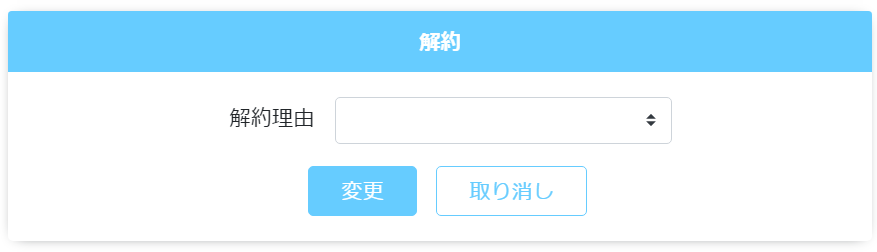

# 定期購入履歴: 解約
||
|:-:|

## Action

| Action No. | Action名 | 概要 | 画面 | 遷移先 | 中継API | 
| --- | --- | --- | --- | --- | --- |
| A | 定期購入解約 | 定期購入を解約する | 1 | own | [order.PeriodicalPurchase/post_periodical_purchases__periodical_purchase_code___update_status_deleted](http://3.114.104.100/#/order.PeriodicalPurchase/post_periodical_purchases__periodical_purchase_code___update_status_deleted) |

## 中継API
### A: 定期購入解約

| API名 | リンク |
| --- | --- |
| 定期購入解約API | [order.PeriodicalPurchase/post_periodical_purchases__periodical_purchase_code___update_status_deleted](http://3.114.104.100/#/order.PeriodicalPurchase/post_periodical_purchases__periodical_purchase_code___update_status_deleted) |

#### Request

| 必須 | 物理名 | 型（桁） | 論理名(David) | 論理名（Prismatix） |
| --- | --- | --- | --- | --- |
| 〇 | periodical_purchase_code(Excelなし) |  |  |  |
| 〇 | status | string | 退会区分 | 会員ステータス |

#### Response

| 必須 | 物理名 | 型（桁） | 論理名(David) | 論理名（Prismatix） |
| --- | --- | --- | --- | --- |
|  | (status_code) |  |  |  |

## 質問事項
| Action NO.| Request or Response | 質問内容 |
| ---| --- | --- |
| A | Request | status はどのExcelファイルを参照すれば良いのか(表には会員リソース20191127-01のものを記入)

## 確認事項
* 解約理由一覧を取得するAPIは無いのか
* 解約理由を適用させるAPIは無いのか
* 定期購入解約APIの Response に解約理由がない