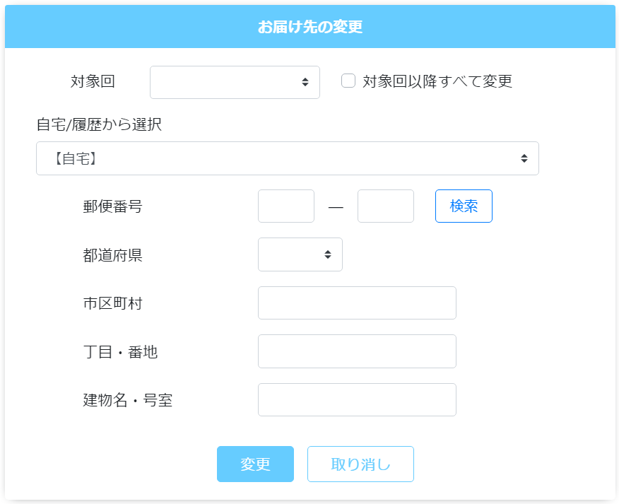

# 定期購入履歴: 配送
||
|:-:|

## Action

| Action No. | Action名 | 概要 | 画面 | 遷移先 | 中継API | 
| --- | --- | --- | --- | --- | --- |
| A | 会員の定期購入一覧取得 | 会員の有効な定期購入一覧を取得する | 1 | own |　[order.PeriodicalPurchase/get_periodical_purchases__by_customer__customer_code_](http://3.114.104.100/#/order.PeriodicalPurchase/get_periodical_purchases__by_customer__customer_code_) |
| B | 配送先変更 | 配送先を変更する | 1 | own |　[customer.DeliveryInfo/put_customers__customer_code__delivery_info__delivery_info_code_](http://3.114.104.100/#/customer.DeliveryInfo/put_customers__customer_code__delivery_info__delivery_info_code_) |
| C | カート配送先変更 | 定期購入カートの配送先を変更する | 1 | own |　 |
| D | カート配送先設定（登録住所/配送先住所をチェック） | 登録住所と配送先住所が同じかチェックする | | own | [order.Cart/post_carts__cart_code___check_address](http://3.114.104.100/#/order.Cart/post_carts__cart_code___check_address) |

## 中継API
### A: 会員の定期購入一覧取得

| API名 | リンク |
| --- | --- |
| 定期購入一覧取得API | [order.PeriodicalPurchase/get_periodical_purchases__by_customer__customer_code_](http://3.114.104.100/#/order.PeriodicalPurchase/get_periodical_purchases__by_customer__customer_code_) |

#### Request

| 必須 | 物理名 | 型（桁） | 論理名(David) | 論理名（Prismatix） |
| --- | --- | --- | --- | --- |
| 〇 | customer_code | string | 会員コード | 同左 |

#### Response

| 必須 | 物理名 | 型（桁） | 論理名(David) | 論理名（Prismatix） |
| --- | --- | --- | --- | --- |
|  | periodical_purchases[periodical_purchase_code](Excelなし) |  |  |  |
|  | periodical_purchases[delivery_details][delivery_plan_timestamp] (Excelなし) |  |  |  |
|  | periodical_purchases[cart_code_prefix] (Excelなし) |  |  |  |

### B: 配送先変更

| API名 | リンク |
| --- | --- |
| 定期購入一覧取得API | [order.PeriodicalPurchase/get_periodical_purchases__by_customer__customer_code_](http://3.114.104.100/#/order.PeriodicalPurchase/get_periodical_purchases__by_customer__customer_code_) |

#### Request

| 必須 | 物理名 | 型（桁） | 論理名(David) | 論理名（Prismatix） |
| --- | --- | --- | --- | --- |
| 〇 | customer_code | string | 会員コード | 同左 |

#### Response

| 必須 | 物理名 | 型（桁） | 論理名(David) | 論理名（Prismatix） |
| --- | --- | --- | --- | --- |
| 〇 | periodical_purchase_code(Excelなし) |  |  |  |
| 〇 | delivery_details[delivery_plan_timestamp] (Excelなし) |  |  |  |

### C: カート配送先変更

| API名 | リンク |
| --- | --- |
| カート配送先変更API |  |

#### Request

| 必須 | 物理名 | 型（桁） | 論理名(David) | 論理名（Prismatix） |
| --- | --- | --- | --- | --- |
|  |  |  |  |  |

#### Response

| 必須 | 物理名 | 型（桁） | 論理名(David) | 論理名（Prismatix） |
| --- | --- | --- | --- | --- |
|  |  |  |  |  |

### D: カート配送先設定（登録住所/配送先住所をチェック）

| API名 | リンク |
| --- | --- |
| カート配送先確認API | [order.Cart/post_carts__cart_code___check_address](http://3.114.104.100/#/order.Cart/post_carts__cart_code___check_address) |

#### Request

| 必須 | 物理名 | 型（桁） | 論理名(David) | 論理名（Prismatix） |
| --- | --- | --- | --- | --- |
| 〇 | cart_code(Excelなし) |  |  |  |
| 〇 | customer_code | string | 会員コード | 同左 |
| 〇 | order_code(Excelなし) |  |  |  |

#### Response

| 必須 | 物理名 | 型（桁） | 論理名(David) | 論理名（Prismatix） |
| --- | --- | --- | --- | --- |
|  | same_address_flag(Excelなし) |  |  |  |

## 確認事項
* 対象回と紐づけてカートの配送先を変更できるAPIは無いのか？