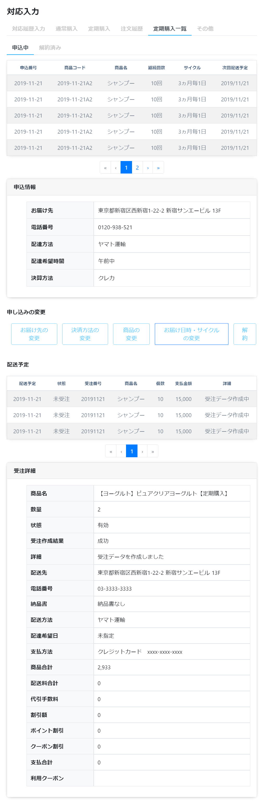
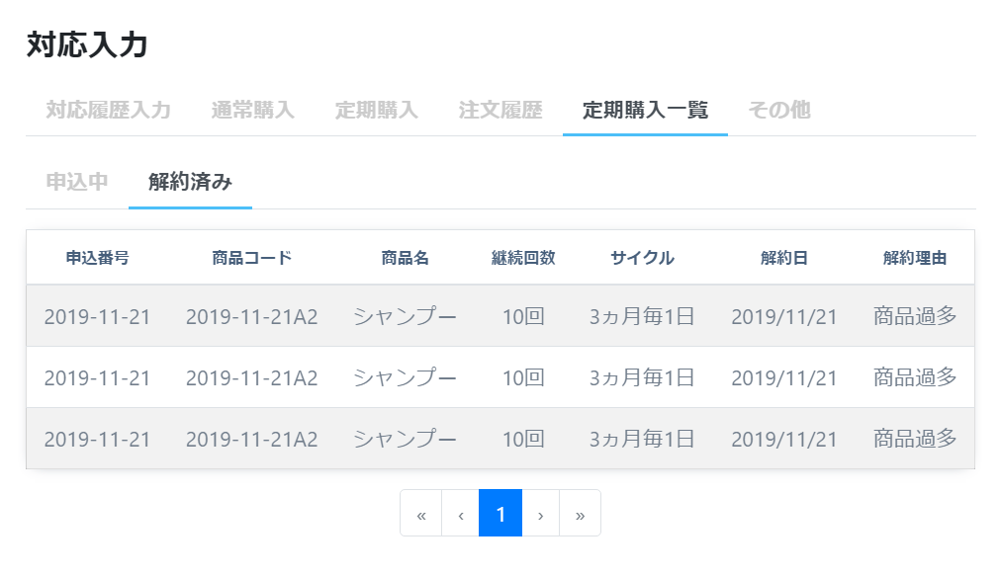

# 定期購入履歴: 詳細
||
|:-:|

||
|:-:|

## Action

| Action No. | Action名 | 概要 | 画面 | 遷移先 | 中継API | 
| --- | --- | --- | --- | --- | --- |
| A | 定期購入一覧取得 | 会員の定期購入一覧を取得する | 1 | own | [order.PeriodicalPurchase/get_periodical_purchases__by_customer__customer_code_](http://3.114.104.100/#/order.PeriodicalPurchase/get_periodical_purchases__by_customer__customer_code_) |
| B | 定期購入詳細取得 |商品単位の定期購入詳細を取得する | 1 | own | [order.PeriodicalPurchase/get_periodical_purchases__periodical_purchase_code_](http://3.114.104.100/#/order.PeriodicalPurchase/get_periodical_purchases__periodical_purchase_code_) |
| C | 配送予定一覧取得 | 商品単位で配送予定一覧を取得する | 1 | own | [query.Query/post_query_order__search](http://3.114.104.100/#/query.Query/post_query_order__search) |
| D | 受注詳細取得 | 受注詳細を取得する | 1 | own | [order.Order/get_orders__order_code_](http://3.114.104.100/#/order.Order/get_orders__order_code_) |

## 中継API
### A: 定期購入一覧取得

| API名 | リンク |
| --- | --- |
| 定期購入一覧取得API | [order.PeriodicalPurchase/get_periodical_purchases__by_customer__customer_code_](http://3.114.104.100/#/order.PeriodicalPurchase/get_periodical_purchases__by_customer__customer_code_) |

#### Request

| 必須 | 物理名 | 型（桁） | 論理名(David) | 論理名（Prismatix） |
| --- | --- | --- | --- | --- |
| 〇 | customer_code | string | 会員コード | 同左 |

#### Response

| 必須 | 物理名 | 型（桁） | 論理名(David) | 論理名（Prismatix） |
| --- | --- | --- | --- | --- |
|  | periodical_purchases[deleted] | boolean | 論理削除フラグ | 同左 |
|  | periodical_purchases[periodical_purchase_code] (Excelなし) |  |  |  |
|  | periodical_purchases[sku][sku_code] | string | SKUコード | 同左 |
|  | periodical_purchases[sku][sku_name] | string | 社内登録名称（愛称） | SKU
|  | periodical_purchases[purchase_interval] (Excelなし) |  |  |  |
|  | periodical_purchases[schedule_type] (Excelなし) |  |  |  |
|  | periodical_purchases[delivery_details][delivery_type] | string | 配送区分 | 同左 |
|  | periodical_purchases[delivery_details][delivery_plan_timestamp] (Excelなし) |  |  |  |

### B: 定期購入詳細取得

| API名 | リンク |
| --- | --- |
| 配送先取得API | [order.PeriodicalPurchase/get_periodical_purchases__periodical_purchase_code_](http://3.114.104.100/#/order.PeriodicalPurchase/get_periodical_purchases__periodical_purchase_code_) |

#### Request

| 必須 | 物理名 | 型（桁） | 論理名(David) | 論理名（Prismatix） |
| --- | --- | --- | --- | --- |
| 〇 | periodical_purchase_code(Excelなし) |  |  |  |

#### Response

| 必須 | 物理名 | 型（桁） | 論理名(David) | 論理名（Prismatix） |
| --- | --- | --- | --- | --- |
| 〇 | delivery_details[delivery_type] | string | 配送区分 | 同左 |
| 〇 | delivery_details[delivery_company_code] (Excelなし) |  |  |  |
| 〇 | delivery_details[delivery_wish_timestamp] (Excelなし) |  |  |  |
| 〇 | payment_method(Excelなし) |  |  |  |

### C: 配送予定一覧取得

| API名 | リンク |
| --- | --- |
| 配送予定一覧取得API | [query.Query/post_query_order__search](http://3.114.104.100/#/query.Query/post_query_order__search) |

#### Request

| 必須 | 物理名 | 型（桁） | 論理名(David) | 論理名（Prismatix） |
| --- | --- | --- | --- | --- |
|  | size | string | サイズ | 同左 |
|  | from(Excelなし) |  |  |  |
|  | customer_code | string | 会員コード | 同左 |
|  | filters(Excelなし) |  |  |  |

#### Response

| 必須 | 物理名 | 型（桁） | 論理名(David) | 論理名（Prismatix） |
| --- | --- | --- | --- | --- |
|  | hits[hits][total] (Excelなし) |  |  |  |
|  | hits[hits][_source][shipped_timestamp] (Excelなし) |  |  |  |
|  | hits[hits][_source][order_status] (Excelなし) |  |  |  |
|  | hits[hits][_source][order_code] (Excelなし) |  |  |  |
|  | hits[hits][_source][order_details][sku_code] | string | SKUコード | 同左 |
|  | hits[hits][_source][order_details][sku_name] | string | 社内登録名称（愛称） | SKU名 |
|  | hits[hits][_source][order_details][quantity] (Excelなし) |  |  |  |
|  | hits[hits][_source][order_details][sku_details] (Excelなし) |  |  |  |
|  | hits[hits][_source][total_ex_vat] (Excelなし) |  |  |  |
|  | hits[hits][_source][total_in_vat] (Excelなし) |  |  |  |

### D: 受注詳細取得

| API名 | リンク |
| --- | --- |
| 配送先取得API | [order.Order/get_orders__order_code_](http://3.114.104.100/#/order.Order/get_orders__order_code_) |

#### Request

| 必須 | 物理名 | 型（桁） | 論理名(David) | 論理名（Prismatix） |
| --- | --- | --- | --- | --- |
| 〇 | order_code(Excelなし) |  |  |  |

#### Response

| 必須 | 物理名 | 型（桁） | 論理名(David) | 論理名（Prismatix） |
| --- | --- | --- | --- | --- |
|  | order_details[sku_code] | string | SKUコード | 同左 |
|  | order_details[sku_name] | string | 社内登録名称（愛称） | SKU名 |
|  | order_details[quantity] (Excelなし) |  |  |  |
|  | order_details[sku_details] (Excelなし) |  |  |  |
|  | order_details[price_ex_vat] | decimal | 税抜売価 | 同左 |
|  | order_details[price_in_vat] | decimal | 税込定価 | 同左 |
|  | delivery_address[delivery_info_code] | string | 配送先情報コード | 同左 |
|  | delivery_address[zip_code] | string | 郵便番号（ハイフンあり） | 郵便番号 |
|  | delivery_address[country] | string | 国 | 同左 |
|  | delivery_address[state] | string | 都道府県/州 | 同左 |
|  | delivery_address[city] | string | 市町村 | 同左 |
|  | delivery_address[address1] | string | 住所 1 (地域/字) | 同左 |
|  | delivery_address[address2] | string | 住所 2 (番地/建物名) | 同
|  | delivery_address[tel] | string | 電話番号(ハイフン無し) | 電話番号 |
|  | delivery_details[delivery_type] | string | 配送区分 | 同左 |
|  | delivery_details[delivery_company_code] (Excelなし) |  |  |  |
|  | delivery_details[delivery_wish_timestamp] (Excelなし) |  |  |  |
|  | order_addon_services[addon_service_code] | string | 付帯作業価格コード | 同左 |
|  | order_addon_services[amount_ex_vat] (Excelなし) |  |  |  |
|  | order_addon_services[amount_in_vat] (Excelなし) |  |  |  |
|  | discount_details[discount_ex_vat] (Excelなし) |  |  |  |
|  | discount_details[discount_in_vat] (Excelなし) |  |  |  |
|  | discount_details[coupons][issued_coupon_code] (Excelなし) |  |  |  |
|  | discount_details[coupons][discount_type] (Excelなし) |  |  |  |
|  | issued_coupons[issued_coupon_code] (Excelなし) |  |  |  |
|  | issued_coupons[coupon_details] (Excelなし) |  |  |  |
|  | order_status(Excelなし) |  |  |  |
|  | periodical_purchase_codes(Excelなし) |  |  |  |
|  | payment_method(Excelなし) |  |  |  |
|  | delivery_fee_ex_vat(Excelなし) |  |  |  |
|  | delivery_fee_in_vat(Excelなし) |  |  |  |
|  | total_ex_vat(Excelなし) |  |  |  |
|  | total_in_vat(Excelなし) |  |  |  |

## 質問事項
| Action NO.| Request or Response | 質問内容 |
| ---| --- | --- |
| A | Response | periodical_purchases[deleted] はどのExcelファイルを参照すれば良いのか(表にはフィードリソース20191118-01のものを記入したが恐らく参照するExcelファイルが違い、尚且つ参照するべきExcelファイルが存在しない)|
| A | Response | periodical_purchases[sku][sku_code] はどのExcelファイルを参照すれば良いのか(表には単品リソース20191202-01のものを記入したが恐らく参照するExcelファイルが違い、尚且つ参照するべきExcelファイルが存在しない)|
| A | Response | periodical_purchases[sku][sku_name] はどのExcelファイルを参照すれば良いのか(表には単品リソース20191202-01のものを記入したが恐らく参照するExcelファイルが違い、尚且つ参照するべきExcelファイルが存在しない)|
| A | Response | periodical_purchases[delivery_details][delivery_type] はどのExcelファイルを参照すれば良いのか(表には単品リソース20191202-01のものを記入したが恐らく参照するExcelファイルが違い、尚且つ参照するべきExcelファイルが存在しない)|
| B | Response | delivery_details[delivery_type] はどのExcelファイルを参照すれば良いのか(表には単品リソース_20191030-01のものを記入したが恐らく参照するExcelファイルが違い、尚且つ参照するべきExcelファイルが存在しない) |
| C | Response | hits[hits][_source][order_details][sku_code] はどのExcelファイルを参照すれば良いのか(表には単品リソース20191202-01のものを記入したが恐らく参照するExcelファイルが違い、尚且つ参照するべきExcelファイルが存在しない)|
| C | Response | hits[hits][_source][order_details][sku_name] はどのExcelファイルを参照すれば良いのか(表には単品リソース20191202-01のものを記入したが恐らく参照するExcelファイルが違い、尚且つ参照するべきExcelファイルが存在しない)|
| D | Response | order_details[sku_code] はどのExcelファイルを参照すれば良いのか(表には単品リソース20191202-01のものを記入したが恐らく参照するExcelファイルが違い、尚且つ参照するべきExcelファイルが存在しない)|
| D | Response | order_details[sku_name] はどのExcelファイルを参照すれば良いのか(表には単品リソース20191202-01のものを記入したが恐らく参照するExcelファイルが違い、尚且つ参照するべきExcelファイルが存在しない)|
| D | Response | order_details[price_ex_vat] はどのExcelファイルを参照すれば良いのか(表には価格リソース20191126-01のものを記入したが恐らく参照するExcelファイルが違い、尚且つ参照するべきExcelファイルが存在しない)|
| D | Response | order_details[price_in_vat] はどのExcelファイルを参照すれば良いのか(表には単品リソース20191126-01のものを記入したが恐らく参照するExcelファイルが違い、尚且つ参照するべきExcelファイルが存在しない)|
| D | Response | delivery_address[delivery_info_code] はどのExcelファイルを参照すれば良いのか(表には配送先リソース20191101-01のものを記入したが恐らく参照するExcelファイルが違い、尚且つ参照するべきExcelファイルが存在しない)|
| D | Response | delivery_address[zip_code] はどのExcelファイルを参照すれば良いのか(表には配送先リソース_20191101-01のものを記入したが恐らく参照するExcelファイルが違い、尚且つ参照するべきExcelファイルが存在しない)|
| D | Response | delivery_address[country] はどのExcelファイルを参照すれば良いのか(表には配送先リソース_20191101-01のものを記入したが恐らく参照するExcelファイルが違い、尚且つ参照するべきExcelファイルが存在しない)|
| D | Response | delivery_address[state] はどのExcelファイルを参照すれば良いのか(表には配送先リソース_20191101-01のものを記入したが恐らく参照するExcelファイルが違い、尚且つ参照するべきExcelファイルが存在しない)|
| D | Response | delivery_address[city] はどのExcelファイルを参照すれば良いのか(表には配送先リソース_20191101-01のものを記入したが恐らく参照するExcelファイルが違い、尚且つ参照するべきExcelファイルが存在しない) |
| D | Response | delivery_address[address1] はどのExcelファイルを参照すれば良いのか(表には配送先リソース_20191101-01のものを記入したが恐らく参照するExcelファイルが違い、尚且つ参照するべきExcelファイルが存在しない) |
| D | Response | delivery_address[address2] はどのExcelファイルを参照すれば良いのか(表には配送先リソース_20191101-01のものを記入したが恐らく参照するExcelファイルが違い、尚且つ参照するべきExcelファイルが存在しない) |
| D | Response | delivery_address[tel] はどのExcelファイルを参照すれば良いのか(表には配送先リソース_20191101-01のものを記入したが恐らく参照するExcelファイルが違い、尚且つ参照するべきExcelファイルが存在しない) |
| D | Response | delivery_details[delivery_type] はどのExcelファイルを参照すれば良いのか(表には単品リソース20191202-01のものを記入したが恐らく参照するExcelファイルが違い、尚且つ参照するべきExcelファイルが存在しない)|
| D | Response | order_addon_services[addon_service_code] はどのExcelファイルを参照すれば良いのか(表には付帯作業価格リソース20191101-01のものを記入したが恐らく参照するExcelファイルが違い、尚且つ参照するべきExcelファイルが存在しない)|

## 確認事項
* 継続回数を取得するのはどのAPI？
* 受注作成結果を取得するのはどのAPI？
* 納品書を取得するのはどのAPI？
* 受注作成結果を取得するのはどのAPI？
* ポイント割引を取得するのはどのAPI？
* クーポン割引はロジックで持つ？

## 注意事項
* C の Request の filters は定期購入商品単位で検索できるような条件が入る