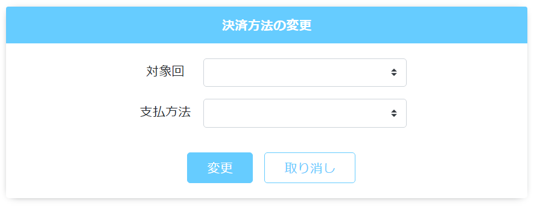

# 定期購入履歴: 支払い
||
|:-:|

## Action

| Action No. | Action名 | 概要 | 画面 | 遷移先 | 中継API | 
| --- | --- | --- | --- | --- | --- |
| A | 会員の定期購入一覧取得 | 会員の有効な定期購入一覧を取得する | 1 | own |　[order.PeriodicalPurchase/get_periodical_purchases__by_customer__customer_code_](http://3.114.104.100/#/order.PeriodicalPurchase/get_periodical_purchases__by_customer__customer_code_) |
| B | カート支払方法変更 | 定期購入カートの支払方法を変更する | 1 | own |　 |

## 中継API
### A: 会員の定期購入一覧取得

| API名 | リンク |
| --- | --- |
| 定期購入一覧取得API | [order.PeriodicalPurchase/get_periodical_purchases__by_customer__customer_code_](http://3.114.104.100/#/order.PeriodicalPurchase/get_periodical_purchases__by_customer__customer_code_) |

#### Request

| 必須 | 物理名 | 型（桁） | 論理名(David) | 論理名（Prismatix） |
| --- | --- | --- | --- | --- |
| 〇 | customer_code | string | 会員コード | 同左 |

#### Response

| 必須 | 物理名 | 型（桁） | 論理名(David) | 論理名（Prismatix） |
| --- | --- | --- | --- | --- |
| 〇 | periodical_purchases[periodical_purchase_code](Excelなし) |  |  |  |
| 〇 | periodical_purchases[delivery_details][delivery_plan_timestamp] (Excelなし) |  |  |  |

## 確認事項
* 対象回と紐づけてカートの支払方法を変更できるAPIは無いのか？