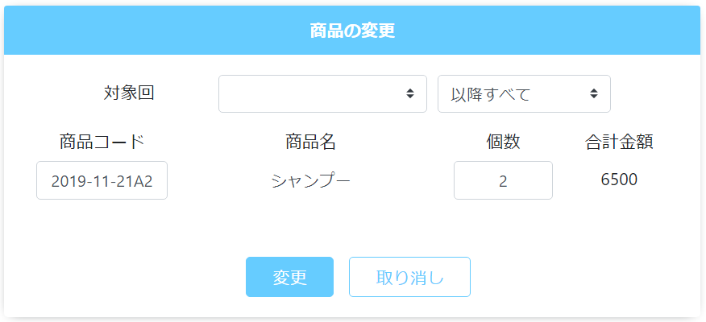

# 定期購入履歴: 商品
||
|:-:|

## Action

| Action No. | Action名 | 概要 | 画面 | 遷移先 | 中継API | 
| --- | --- | --- | --- | --- | --- |
| A | 会員の定期購入一覧取得 | 会員の有効な定期購入一覧を取得する | 1 | own |　[order.PeriodicalPurchase/periodical_purchases_by_customerCustomer_codeGET](http://3.114.104.100/#/order.PeriodicalPurchase/periodical_purchases_by_customerCustomer_codeGET) |
| B | 商品情報取得 | 商品コードから商品名と単価を取得する | 1 | own | [item.Sku/skusSku_codeGET](http://3.114.104.100/#/item.Sku/skusSku_codeGET) |
| C | 定期購入商品変更 | 指定した対象回の定期購入商品を変更する | 1 | own | [order.PeriodicalPurchase/periodical_purchasesPeriodical_purchase_codeSkuPUT](http://3.114.104.100/#/order.PeriodicalPurchase/periodical_purchasesPeriodical_purchase_codeSkuPUT) |

## 中継API
### A: 会員の定期購入一覧取得

| API名 | リンク |
| --- | --- |
| 定期購入一覧取得API | [order.PeriodicalPurchase/periodical_purchases_by_customerCustomer_codeGET](http://3.114.104.100/#/order.PeriodicalPurchase/periodical_purchases_by_customerCustomer_codeGET) |

#### Request

| 必須 | 物理名 | 型（桁） | 論理名(David) | 論理名（Prismatix） |
| --- | --- | --- | --- | --- |
| 〇 | customer_code | string | 会員コード | 同左 |

#### Response

| 必須 | 物理名 | 型（桁） | 論理名(David) | 論理名（Prismatix） |
| --- | --- | --- | --- | --- |
| 〇 | periodical_purchases[periodical_purchase_code] (Excelなし) |  |  |  |
| 〇 | periodical_purchases[delivery_details][delivery_plan_timestamp] (Excelなし) |  |  |  |
|  | periodical_purchases[cart_code_prefix] (Excelなし) |  |  |  |

### B: 商品情報取得

| API名 | リンク |
| --- | --- |
| 注文データ取得API | [item.Sku/get_skus__sku_code_](http://3.114.104.100/#/item.Sku/get_skus__sku_code_) |  

#### Request

| 必須 | 物理名 | 型（桁） | 論理名(David) | 論理名（Prismatix） |
| --- | --- | --- | --- | --- |
| 〇 | sku_code | string | SKUコード | 同左 |

#### Response

| 必須 | 物理名 | 型（桁） | 論理名(David) | 論理名（Prismatix） |
| --- | --- | --- | --- | --- |
| 〇 | sku_name | string | 社内登録名称（愛称） | SKU名 |
|  | base_price_ex_vat(Excelの方がbase_price_ex_batとなってました。) | number | 基本価格(税抜) | 同左 |
|  | base_price_in_vat(Excelの方がbase_price_in_batとなってました。) | number | 基本価格(税込) | 同左 |
|  | store_code | string | 対応店舗 | 同左 |

### C: 定期購入商品変更

| API名 | リンク |
| --- | --- |
| 定期購入商品変更API | [order.PeriodicalPurchase/periodical_purchasesPeriodical_purchase_codeSkuPUT](http://3.114.104.100/#/order.PeriodicalPurchase/periodical_purchasesPeriodical_purchase_codeSkuPUT) |  

#### Request

| 必須 | 物理名 | 型（桁） | 論理名(David) | 論理名（Prismatix） |
| --- | --- | --- | --- | --- |
| 〇 | periodical_purchase_code |  |  |  |
| 〇 | sku_code |  |  |  |
|  | sku_name |  |  |  |
| 〇 | quantity |  |  |  |
|  | price_ex_vat |  |  |  |
|  | price_in_vat |  |  |  |
| 〇 | store_code |  |  |  |

#### Response

| 必須 | 物理名 | 型（桁） | 論理名(David) | 論理名（Prismatix） |
| --- | --- | --- | --- | --- |
|  | (status_code) |  |  |  |

## 確認事項
* C定期購入商品変更のRequestに 対象回(配送予定日), cart_code_prefix が足りない