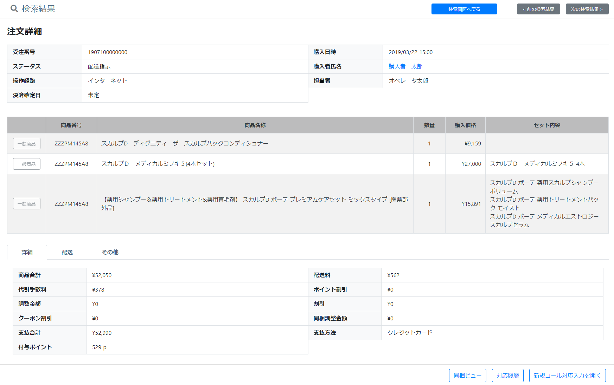
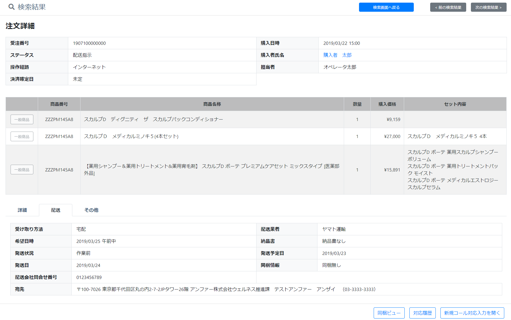
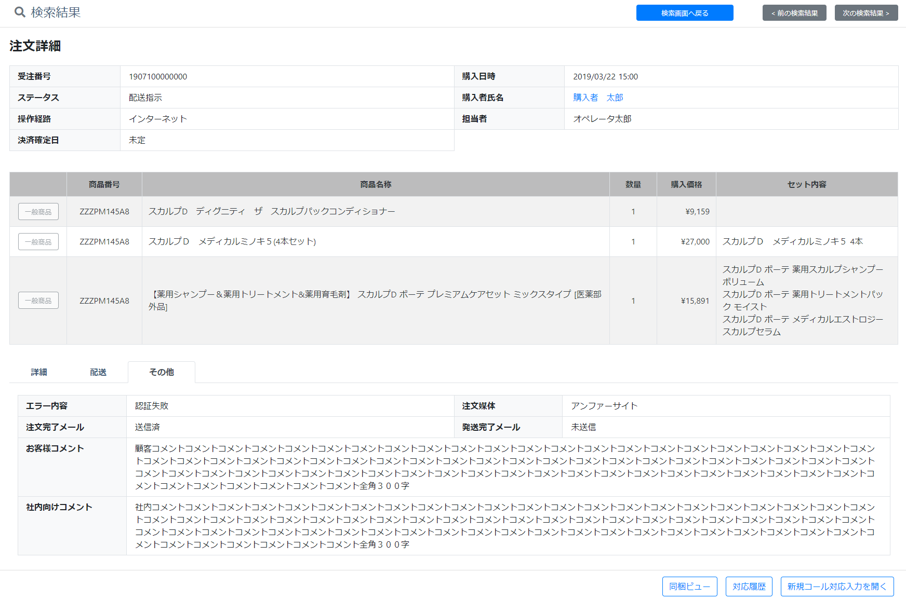

# 受注履歴: 詳細
||
|:-:|

||
|:-:|

||
|:-:|

## Action

| Action No. | Action名 | 概要 | 画面 | 遷移先 | 中継API | 
| --- | --- | --- | --- | --- | --- |
| A | 受注詳細取得 | 受注詳細を取得する | 1 | own | [order.Order/get_orders__order_code_](http://3.114.104.100/#/order.Order/get_orders__order_code_) |
| B | メール状態取得 | 注文完了、発送完了メールの状態を取得する | 1 | own | [notification.MailActivity/get_mail_activities__mail_activity_code___mail_address__mail_address_](http://3.114.104.100/#/notification.MailActivity/get_mail_activities__mail_activity_code___mail_address__mail_address_) |
| C | 検索画面へ遷移 | 検索画面へ戻るボタンを押下し検索画面へ遷移する | 2 | 受注履歴検索 | [] |

## 中継API
### A: 受注詳細取得

| API名 | リンク |
| --- | --- |
| 受注詳細取得API | [order.Order/get_orders__order_code_](http://3.114.104.100/#/order.Order/get_orders__order_code_) |

#### Request

| 必須 | 物理名 | 型（桁） | 論理名(David) | 論理名（Prismatix） |
| --- | --- | --- | --- | --- |
| 〇 | order_code(Excelなし) |  |  |  |

#### Response

| 必須 | 物理名 | 型（桁） | 論理名(David) | 論理名（Prismatix） |
| --- | --- | --- | --- | --- |
| 〇 | order_code(Excelなし) |  |  |  |
|  | checkout_timestamp(Excelなし) |  |  |  |
|  | delivery_status(Excelなし) |  |  |  |
|  | customer[customer_code] | string | 会員コード | 同左 |
|  | customer[name] | JSON | 会員名 (JSON format) | 同左 |
|  | user_order_type(Excelなし) |  |  |  |
|  | paid_timestamp(Excelなし) |  |  |  |
|  | order_details[order_detail_id] (Excelなし) |  |  |  |
|  | order_details[order_detail_code] (Excelなし) |  |  |  |
|  | order_details[sku_code] | string | SKUコード | 同左 |
|  | order_details[sku_name] | string | 社内登録名称（愛称） | SKU 名 |
|  | order_details[quantity] (Excelなし) |  |  |  |
|  | order_details[price_ex_vat] | decimal | 税抜売価 | 同左 |
|  | order_details[price_in_vat] | decimal | 税込売価 | 同左 |
|  | order_details[sku_details] (Excelなし) |  |  |  |
| 〇 | delivery_fee_ex_vat (Excelなし) |  |  |  |
| 〇 | delivery_fee_in_vat (Excelなし) |  |  |  |
|  | order_addon_services[addon_service_code] | string | 付帯作業コード | 同左 |
|  | order_addon_services[addon_service_name] | string | 付帯作業名 | 同左 |
|  | order_addon_services[amount_ex_vat] (Excelなし) |  |  |  |
|  | order_addon_services[amount_in_vat] (Excelなし) |  |  |  |
| 〇 | adjustment_ex_vat(Excelなし) |  |  |  |
| 〇 | adjustment_in_vat(Excelなし) |  |  |  |
| 〇 | discount_ex_vat(Excelなし) |  |  |  |
| 〇 | discount_in_vat(Excelなし) |  |  |  |
|  | discount_details[coupons][issued_coupon_code] (Excelなし) |  |  |  |
|  | discount_details[coupons][discount_type] (Excelなし) |  |  |  |
|  | discount_details[coupons][percent_off_discount_rate] (Excelなし) |  |  |  |
|  | discount_details[coupons][amount_off_discount_ex_vat] (Excelなし) |  |  |  |
|  | payment_method(Excelなし) |  |  |  |
| 〇 | receipt_type(Excelなし) |  |  |  |
|  | delivery_details[delivery_type] | string | 配送区分 | 同左 |
|  | delivery_details[delivery_company_code] (Excelなし) |  |  |  |
|  | delivery_details[delivery_wish_timestamp] (Excelなし) |  |  |  |
|  | delivery_details[delivery_plan_timestamp] (Excelなし) |  |  |  |
|  | shipped_timestamp(Excelなし) |  |  |  |
|  | delivery_address[zip_code] | string | 郵便番号（ハイフンあり） | 郵便番号 |
|  | delivery_address[country] | string | 国 | 同左 |
|  | delivery_address[state] | string | 都道府県/州 | 同左 |
|  | delivery_address[city] | string | 市町村 | 同左 |
|  | delivery_address[address1] | string | 住所 1 (地域/字) | 同左 |
|  | delivery_address[address2] | string | 住所 2 (番地/建物名) | 同左 |
|  | delivery_address[tel] | string | 電話番号(ハイフン無し) | 電話番号 |
|  | store_code | string | 対応店舗 | 同左 |

### B: メール状態取得

| API名 | リンク |
| --- | --- |
| メール状態取得API | [notification.MailActivity/get_mail_activities__mail_activity_code___mail_address__mail_address_](http://3.114.104.100/#/notification.MailActivity/get_mail_activities__mail_activity_code___mail_address__mail_address_) |

#### Request

| 必須 | 物理名 | 型（桁） | 論理名(David) | 論理名（Prismatix） |
| --- | --- | --- | --- | --- |
| 〇 | mail_activity_code(Excelなし) |  |  |  |
| 〇 | mail_address(Excelなし) |  |  |  |
| 〇 | type(Excelなし) |  |  |  |

#### Response

| 必須 | 物理名 | 型（桁） | 論理名(David) | 論理名（Prismatix） |
| --- | --- | --- | --- | --- |
|  | _embedded[mail_activities][status] (Excelなし) |  |  |  |

## 質問事項
| Action NO.| Request or Response | 質問内容 |
| ---| --- | --- |
| A | Response | customer[customer_code] はどのExcelファイルを参照すれば良いのか(表には会員リソース20191203-01のものを記入したが恐らく参照するExcelファイルが違い、尚且つ参照するべきExcelファイルが存在しない)|
| A | Response | hits[hits][_source][customer][customer_code] はどのExcelファイルを参照すれば良いのか(表には会員リソース20191203-01のものを記入したが恐らく参照するExcelファイルが違い、尚且つ参照するべきExcelファイルが存在しない)|
| A | Response | order_details[sku_code] はどのExcelファイルを参照すれば良いのか(表には単品リソース20191202-01のものを記入したが恐らく参照するExcelファイルが違い、尚且つ参照するべきExcelファイルが存在しない)|
| A | Response | order_details[sku_name] はどのExcelファイルを参照すれば良いのか(表には単品リソース20191202-01のものを記入したが恐らく参照するExcelファイルが違い、尚且つ参照するべきExcelファイルが存在しない)|
| A | Response | order_details[price_ex_vat] はどのExcelファイルを参照すれば良いのか(表には価格リソース20191126-01のものを記入したが恐らく参照するExcelファイルが違い、尚且つ参照するべきExcelファイルが存在しない)|
| A | Response | order_details[price_in_vat] はどのExcelファイルを参照すれば良いのか(表には価格リソース20191126-01のものを記入したが恐らく参照するExcelファイルが違い、尚且つ参照するべきExcelファイルが存在しない)|
| A | Response | order_addon_services[addon_service_code] はどのExcelファイルを参照すれば良いのか(表には付帯作業リソース20191204-01のものを記入したが恐らく参照するExcelファイルが違い、尚且つ参照するべきExcelファイルが存在しない)|
| A | Response | order_addon_services[addon_service_name] はどのExcelファイルを参照すれば良いのか(表には付帯作業リソース20191204-01のものを記入したが恐らく参照するExcelファイルが違い、尚且つ参照するべきExcelファイルが存在しない)|
| A | Response | delivery_details[delivery_type] はどのExcelファイルを参照すれば良いのか(表には単品リソース20191202-01のものを記入したが恐らく参照するExcelファイルが違い、尚且つ参照するべきExcelファイルが存在しない)|
| A | Response | delivery_address[zip_code] はどのExcelファイルを参照すれば良いのか(表には配送先リソース20191203-01のものを記入したが恐らく参照するExcelファイルが違い、尚且つ参照するべきExcelファイルが存在しない)|
| A | Response | delivery_address[country] はどのExcelファイルを参照すれば良いのか(表には配送先リソース20191203-01のものを記入したが恐らく参照するExcelファイルが違い、尚且つ参照するべきExcelファイルが存在しない)|
| A | Response | delivery_address[state] はどのExcelファイルを参照すれば良いのか(表には配送先リソース20191203-01のものを記入したが恐らく参照するExcelファイルが違い、尚且つ参照するべきExcelファイルが存在しない)|
| A | Response | delivery_address[city] はどのExcelファイルを参照すれば良いのか(表には配送先リソース20191203-01のものを記入したが恐らく参照するExcelファイルが違い、尚且つ参照するべきExcelファイルが存在しない)|
| A | Response | delivery_address[address1] はどのExcelファイルを参照すれば良いのか(表には配送先リソース20191203-01のものを記入したが恐らく参照するExcelファイルが違い、尚且つ参照するべきExcelファイルが存在しない)|
| A | Response | delivery_address[address2] はどのExcelファイルを参照すれば良いのか(表には配送先リソース20191203-01のものを記入したが恐らく参照するExcelファイルが違い、尚且つ参照するべきExcelファイルが存在しない)|
| A | Response | delivery_address[tel] はどのExcelファイルを参照すれば良いのか(表には配送先リソース20191203-01のものを記入したが恐らく参照するExcelファイルが違い、尚且つ参照するべきExcelファイルが存在しない)|

## 確認事項
* 担当者はどのAPIで取得するのか？
* ポイント割引はどのAPIで取得するのか？
* 同梱調整金額はどのAPIで取得するのか？
* 付与ポイントはどのAPIで取得するのか？
* エラー内容はどのAPIで取得するのか？
* お客様コメントはどのAPIで取得するのか？
* 社内向けコメントはどのAPIで取得するのか？