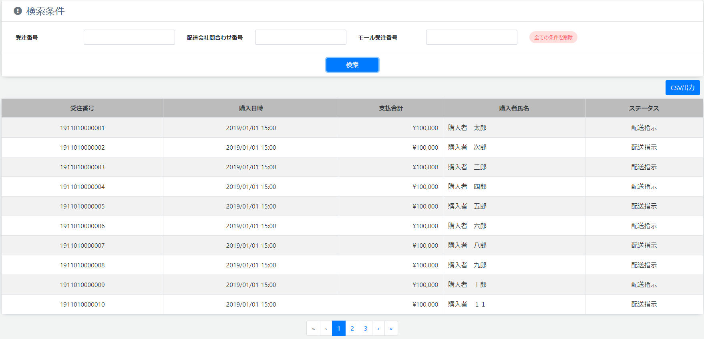

# 受注履歴: 検索
||
|:-:|

## Action

| Action No. | Action名 | 概要 | 画面 | 遷移先 | 中継API | 
| --- | --- | --- | --- | --- | --- |
| A | 受注検索 | 受注履歴を検索する | 1 | own | order.Cart/post_carts |
| B | 詳細画面へ遷移 | 参照したいデータを特定し詳細画面へ遷移する | 2 | 受注履歴詳細 | [] |

## 中継API
### A: 受注検索

| API名 | リンク |
| --- | --- |
| 受注検索API | [order.Cart/post_carts](http://3.114.104.100/#/order.Cart/post_carts) |

#### Request

| 必須 | 物理名 | 型（桁） | 論理名(David) | 論理名（Prismatix） |
| --- | --- | --- | --- | --- |
|  | size(Excelなし) |  |  |  |
|  | from(Excelなし) |  |  |  |
|  | source_includes(Excelなし) |  |  |  |
|  | sort(Excelなし) |  |  |  |
|  | query(Excelなし) |  |  |  |
|  | query_fields(Excelなし) |  |  |  |

#### Response

| 必須 | 物理名 | 型（桁） | 論理名(David) | 論理名（Prismatix） |
| --- | --- | --- | --- | --- |
|  | hits[total] (Excelなし) |  |  |  |
|  | hits[hits][_source][order_code] (Excelなし) |  |  |  |
|  | hits[hits][_source][customer_code] | string | 会員コード | 同左 |
|  | hits[hits][_source][customer][customer_code] | string | 会員コード | 同左 |
|  | hits[hits][_source][customer][name] | JSON | 会員名 (JSON format) | 同左 |
|  | hits[hits][_source][delivery_status] (Excelなし) |  |  |  |
|  | hits[hits][_source][checkout_timestamp] (Excelなし) |  |  |  |

## 質問事項
| Action NO.| Request or Response | 質問内容 |
| ---| --- | --- |
| A | Response | hits[hits][_source][customer_code] はどのExcelファイルを参照すれば良いのか(表には会員リソース20191203-01のものを記入したが恐らく参照するExcelファイルが違い、尚且つ参照するべきExcelファイルが存在しない)|
| A | Response | hits[hits][_source][customer][customer_code] はどのExcelファイルを参照すれば良いのか(表には会員リソース20191203-01のものを記入したが恐らく参照するExcelファイルが違い、尚且つ参照するべきExcelファイルが存在しない)|
| A | Response | hits[hits][_source][customer][name] はどのExcelファイルを参照すれば良いのか(表には会員リソース20191203-01のものを記入したが恐らく参照するExcelファイルが違い、尚且つ参照するべきExcelファイルが存在しない)|